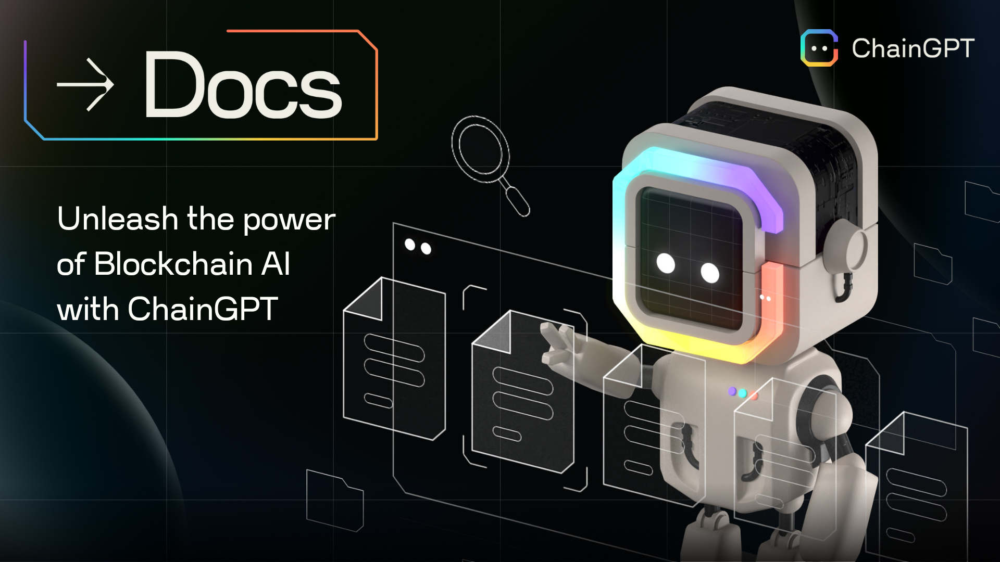

# Introduction

<figure><figcaption></figcaption></figure>

### **Welcome to ChainGPT: Where AI Meets Web3**

ChainGPT is an advanced AI infrastructure that develops AI-powered technologies for the Web3, Blockchain, and Crypto space. We aim to improve the Web3 space for retail users & startups by developing AI-powered solutions designed explicitly for Web3. From LLMs to Web3 AI Tools, ChainGPT is the go-to place to boost your Web3 flow with Artificial Intelligence.

### **ChainGPT's Solutions:**

* ChainGPT AI Chatbot ([Telegram](https://t.me/chaingptai\_bot), Discord, [Web](http://127.0.0.1:5000/o/fTvkvEH3C5Wk9LTutCYV/s/rfpYYsoCgHxbOIGhZ3WU/) - Read More: [ai-web3-chatbot.md](the-ecosystem/ai-tools-and-applications/ai-web3-chatbot.md "mention"))
* AI NFT Generator ([Visit App](https://nft.chaingpt.org) - Read More: [ai-nft-generator.md](the-ecosystem/ai-tools-and-applications/ai-nft-generator.md "mention"))
* AI-Generated News ([Visit App](https://app.chaingpt.org/news) - Read More: [ai-generated-news.md](the-ecosystem/ai-tools-and-applications/ai-generated-news.md "mention"))
* Smart-Contracts Generator ([Visit App](https://app.chaingpt.org) -Read More: [ai-smart-contract-generator.md](the-ecosystem/ai-tools-and-applications/ai-smart-contract-generator.md "mention"))
* Smart-Contracts Auditor ([Visit App](https://app.chaingpt.org) - Read More: [ai-smart-contract-auditor.md](the-ecosystem/ai-tools-and-applications/ai-smart-contract-auditor.md "mention"))
* AI Trading Assistant ([Visit App](https://app.chaingpt.org) - Read More: [ai-trading-assistant.md](the-ecosystem/ai-tools-and-applications/ai-trading-assistant.md "mention"))
* ChainGPT Pad ([Visit App](https://pad.chaingpt.org) - Read More: [chaingpt-pad](the-ecosystem/chaingpt-pad/ "mention"))
* ChainGPT LLMs & TTIMs (Read More: [llms-and-ttims.md](the-ecosystem/llms-and-ttims.md "mention"))
* AI-Powered Security Extension (Coming Soon)
* AI Blockchain Analytics
* ChainGPT Labs (VC Arm)
* Incubation & Acceleration Program for AI Startups (Read More: [incubation-program](misc/incubation-program/ "mention"))
* Whitelabels: AI Chatbot, Launchpad, & more! (Read More: [b2b-offerings](misc/b2b-offerings/ "mention"))

The solutions developed by ChainGPT are tailored for retail users and enterprises. ChainGPT believes in developing open technologies and does not gate-keep the LLMs & applications developed by ChainGPT from other Web3 companies. Everyone is welcome to access ChainGPT's API & SDKs.

### **$CGPT Utility Token:**

The ecosystem is backed by the $CGPT utility token, the infrastructure's backbone. The $CGPT token grants holders & stakers access to DAO voting, staking, pad allocation, Freemium access to AI tools, airdrops & more. $CGPT is currently held on decentralized wallets by 16,000+ unique and active users.

### **Quick Stats:**

**-** 100,000+ weekly active users\
\- 20,000+ $CGPT token holders (decentralized)\
\- Listed on top CEXs (ByBit, KuCoin, Gate \&more) \
\- Backed by Google, BNB, Tron & others\
\- Partnered with 80+ leading Web3 companies ([full list](https://www.chaingpt.org/#team))

### **ChainGPT's recent awards & grants:**

\- Google Cloud Grant ($350,000)\
\- NVIDIA Grant ($100,000)\
\- BNB Chain Ecosystem Catalyst Award (Innovation Excellence)\
\- BNB Chain Gas Grant Program\
\- #1 Web3 App of April, 2023 (ProductHunt)\
\- Website of the day by Awwwards\
\- #4 ranked Web3 Telegram bot by Binance Research

***

**Official Links:**\
[Website](https://www.chaingpt.org/) | [Crypto AI Hub](https://app.chaingpt.org/) | [AI NFT Generator](https://nft.chaingpt.org/) | [ChainGPT Pad](https://pad.chaingpt.org/) | [AI-Generated News](https://app.chaingpt.org/news) | [ChainGPT DAO](https://dao.chaingpt.org/) | [$CGPT Staking](https://staking.chaingpt.org/) | [Blog](https://www.chaingpt.org/blog) | [Brand-Kit](https://www.chaingpt.org/brand-kit) |&#x20;

**Social Media Links - Join Our Community:**\
[Twitter](https://twitter.com/Chain\_GPT) | [Pad Twitter](https://twitter.com/chaingpt\_pad) | [Telegram Group](https://t.me/chaingpt) | [Telegram Channel](https://t.me/chaingptnews) | [Discord](https://discord.gg/chaingpt) | [CMC](https://coinmarketcap.com/community/profile/ChainGPT/) | [Youtube](https://www.youtube.com/@ChainGPT) | [Instagram](https://instagram.com/ChainGPTAI) | [Medium](https://medium.com/@chaingpt) | [Linkedin](https://www.linkedin.com/company/chaingpt) |

***

[**Disclaimer**](misc/legal-docs/disclaimer.md)
