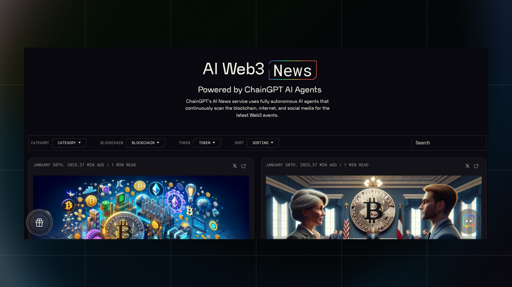

# AI Generated News



<figure><figcaption></figcaption></figure>

> Built from scratch, ChainGPT created an advanced AI News Agent for an automated feed of sourced, organized, and presented information in real-time.

### Overview of ChainGPT AI News Generator

Built from scratch, ChainGPT created an advanced AI News Agent to deliver an automated feed of sourced, organized, and presented information in real time.

News is vital for spreading important information. But it can also be controversial and biased. Crypto, blockchain, and Web3 are fast-moving industries with non-stop markets and constant information changes. Keeping up with Web3 news is challenging.

Staying updated can feel overwhelming. Sorting through endless information drains energy and makes it hard to find what matters. That’s why ChainGPT developed an AI-powered News Agent—to simplify the way we consume Web3 news.

* No more endless scrolling through social media.
* No more saving countless websites.
* No more biased publications.
* No more confusion.
* Just the facts.

### Introducing The ChainGPT Automated AI News Agent

ChainGPT’s AI News Agent searches the internet for breaking news from trusted Crypto/Web3 outlets like Decrypt, CoinDesk, and CoinTelegraph. It cross-references this with social signals from platforms like Twitter (X).

After gathering key information, the AI News Agent reads each article, identifies consistent truths, and summarizes the most important points. It highlights valuable insights and removes unnecessary details.

Unlike human-curated news sources that introduce personal opinions and biases, ChainGPT’s AI News Agent follows the algorithm. It operates autonomously with a self-checking system to ensure the accuracy of delivered news.

### Key Benefits

* Gathers real-time information from the internet
* Summarizes key points from multiple sources
* Removes unnecessary content for clarity
* Reduces human bias in reporting

<figure><figcaption></figcaption></figure>

### Use Cases & Applications

The AI News Agent serves multiple audiences and can be applied in different ways:

* Community Modules: Providing the latest Web3 updates for Telegram, Discord, or custom platforms
* Daily News Releases: Automating news updates for media agencies and crypto projects
* Trading Insights: Interactive trading guides powered by real-time AI news analytics

#### Live Implementation

ChainGPT’s AI News Agent is already in use. Two key interfaces demonstrate its power:

1. On the official dashboard, a daily market snapshot posts at 8:00 AM UTC.

* Check it out here:[ https://app.chaingpt.org/news](https://app.chaingpt.org/news)

2. Through Binance Square, where AI-curated Web3 news is published through the ChainGPT AI News Generator.

* Check it out here: [https://www.binance.com/en/square](https://www.binance.com/en/square)

<figure><figcaption></figcaption></figure>

Since the AI News Agent module is built into ChainGPT’s AI ecosystem, the chatbot also provides live market updates. You can access news by chatting with it via:

* The Official App Interface:[ https://app.chaingpt.org/](https://app.chaingpt.org/)
* The Telegram Group:[ https://t.me/chaingpt](https://t.me/chaingpt)

Adding the chatbot to Telegram or Discord allows communities to receive instant AI-powered news updates.

### Integrate Your Own AI News&#x20;

Looking to integrate AI-powered news into your platform?

* Use our [SDK & API](https://docs.chaingpt.org/the-ecosystem/apis-and-sdks?_gl=1*528ftt*_gcl_au*MTIxNjYzNTMyLjE3MzYzMzA2ODk.) to access AI-driven news updates tailored to your business.
* Ideal for media companies, trading platforms, and crypto enterprises.

Reach out to our [BD team](https://t.me/JakeCGPT) to see where the ChainGPT AI Agent can work with your project!

### What's Next? Nova Integration

In addition to web and chatbot interfaces, the AI News Agent is integrated into Nova, ChainGPT’s latest Twitter (X) AI Agent.

This is the first of its kind. A Twitter news agent delivering Web3 headlines directly to your newsfeed.&#x20;

Be sure to check out [Nova AI News Agent](https://x.com/ChainGPTAINews) for yourself!

<figure><figcaption></figcaption></figure>

### Start Using AI-Powered News Today

To begin viewing the AI Agent news, you can head straight to the ChainGPT site for your daily news updates from across the blockchain.&#x20;

And to get these updates direct to your X/Twitter feed, follow Nova!

Visit:[ https://app.chaingpt.org/news](https://app.chaingpt.org/news)

Follow: [https://x.com/ChainGPTAINews](https://x.com/ChainGPTAINews)

\

\
