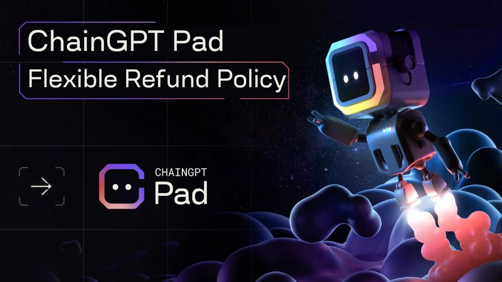

# Refund Policy

<figure><figcaption></figcaption></figure>

To accommodate the changing needs of market participants and unexpected situations, ChainGPT has introduced a "refund" feature.

Each project on ChainGPT's platform will have its own refund guidelines, determined by the ChainGPT team and usually within a timeframe of 7-14 days. During this period, users have the choice to commit to participation or opt for a refund. However, once a decision is made and users select the "claim" option, the refund feature is no longer available.
