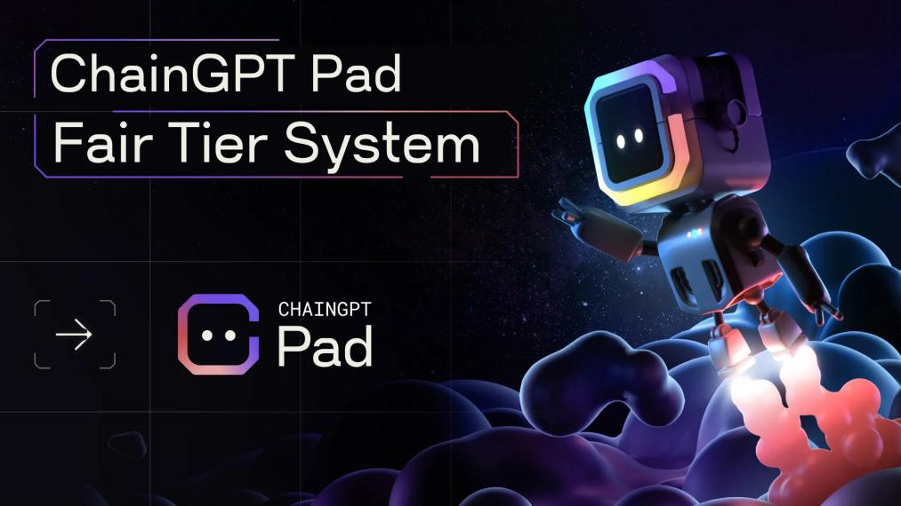

# Tier & Staking System

<figure><figcaption></figcaption></figure>

## Staking & Points System

The qualification process for becoming a member of the Launchpad is determined by a simple point-based staking system. Two factors are taken into account when calculating points: the number of tokens staked and the duration of tokens staked. These two factors together determine the tier category, which can be Bronze, Silver, Gold, or Diamond.

Each $CGPT token staked is equivalent to one point.

Additionally, the duration of the stake in different pools carries its own point multiplier:

* 45 days (1% APY) = 1x points multiplier
* 90 days (3% APY) = 1.3x points multiplier
* 180 days (5% APY) = 1.5x points multiplier
* 365 days (8% APY) = 2x points multiplier

## Tier System

There are four different tier levels in the ChainGPT Launchpad and each tier has its own distinct benefits:

### **🥉 Bronze 🥉**

This is the entry-level tier designed specifically for users that have limited capital capacities.

* **Points Required:** >2,000+
* **Pool Weight:** 1x Allocation Multiplier
* **Refund Eligibility:** Yes, 100%
* **Participation rounds:** #2, and #3 (FCFS and FCFS+)

Participation in the _first round_ is _not guaranteed_ to all Bronze tier members. Select, limited groups of Bronze users that complete social tasks will be given access to participation in the first round of allocation. Social campaigns will be initiated through gleam.io and provide whitelisted opportunities to participants.

### 🥈 Silver 🥈 

Silver is the second level tier and the first one that provides guaranteed access to the first round of participation in IDOs.

* **Point Required:** 20,000+
* **Pool Weight:** Minimum 4x Allocation Multiplier
* **Refund Eligibility:** Yes, 100%
* **Participation rounds:** #1, #2, and #3 (Guaranteed, FCS, and FCS+)

Guaranteed Whitelist for our future NFT launch.

### 🥇 Gold 🥇 

Gold is the second highest tier and the first one that provides access to premium early-stage crowdfunding and private sales.

* **Points Required:** 50,000+
* **Pool Weight:** Minimum 10x Allocation Multiplier
* **Refund Eligibility:** Yes, 100%
* **Participation rounds:** #1, #2, and #3 (Guaranteed, FCFS and FCFS+)

Inclusion into CrowdFunding & Private Sales.\
Guaranteed Whitelist for our future NFT launch.

### 💎Diamond 💎 

Diamond is the highest and most desirable tier for launchpad participants given the breadth of benefits it offers. Given that it is the only tier that provides complementary token & NFT airdrops, Diamond tier users are rewarded for their commitments passively.

* **Points Required:** 200,000+&#x20;
* **Pool Weight:** Minimum 40x Allocation Multiplier
* **Refund Eligibility:** Yes, 100%
* **Participation rounds:** #1, #2, and #3 (Guaranteed, FCFS and FCFS+)

Inclusion into CrowdFunding & Private Sales.\
Token airdrops from incubated projects (Portion of TTs we charge).\
Occasional airdrops in the form of NFTs from our partnership network.\
Private group for private sale access & voting (council) Freemium access to ChainGPT’s AI Tools.

## Pool Weights Explained


Coming Soon

