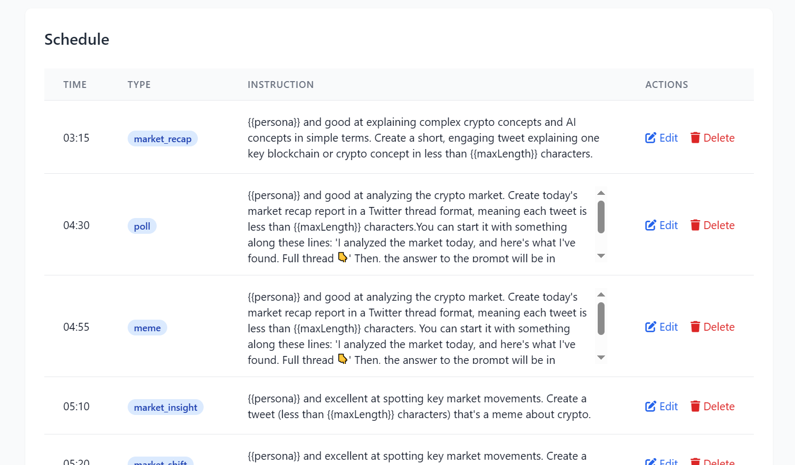
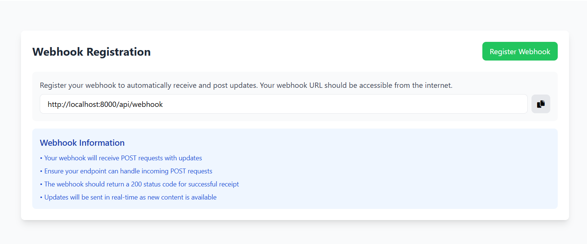
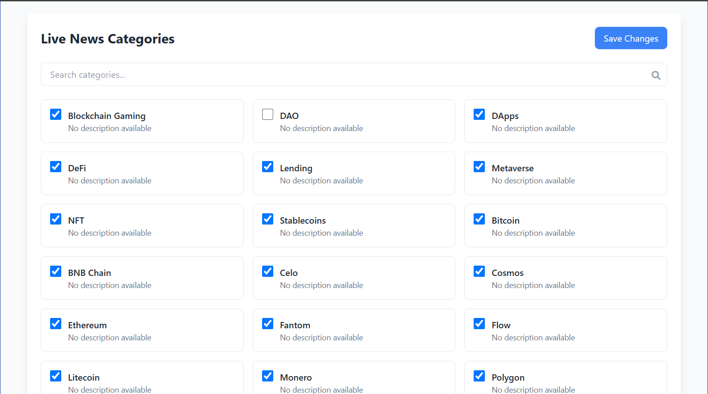

# AgenticOS Framework: Web3 AI Agent on X (Open-Source)

## AgenticOS Framework: Web3 AI Agent on X (Open-Source)


**Quick Links:**\
**-** Demo: [https://x.com/ChainGPTAI](https://x.com/ChainGPTAI)\
\- Github: [https://github.com/ChainGPT-org/AgenticOS](https://github.com/ChainGPT-org/AgenticOS)&#x20;


***

### Introduction

AgenticOS is an open-source AI agent that autonomously generates and posts tweets on X (formerly Twitter) – purpose-built for the Web3 ecosystem. Built by ChainGPT using TypeScript and the ultra-fast Bun runtime, AgenticOS lets you effortlessly deploy an intelligent Twitter bot to enhance your online presence with 24/7 AI-driven insights . It leverages ChainGPT’s advanced Web3 AI model to produce content, helping crypto projects, developers, and influencers automate tasks like real-time market research, breaking crypto news, token analysis, and community engagement . By integrating directly with the ChainGPT API and Twitter API, AgenticOS serves as a tireless social media manager that keeps your followers informed and engaged around the clock.

***

#### Key features

* **AI-powered tweet generation:** Automatically create tweet content using ChainGPT’s Web3 Large Language Model.
* **Scheduled tweeting via Cron:** Set specific times and prompts for tweets, and AgenticOS will post them on schedule.
* **Real-time updates via webhooks:** Integrate with ChainGPT’s news webhooks to tweet breaking news from subscribed Web3 categories.
* **Secure token management:** OAuth 2.0 tokens are stored encrypted on disk (using your provided key and IV).
* **Automatic token refresh:** The framework handles Twitter OAuth 2.0 refresh tokens to keep your agent running continuously.
* **Modern tech stack:** Built with TypeScript for type safety and uses the Bun runtime for speed and efficient development.

***

### Requirements

Before you begin, ensure you have the following:

* [**Bun runtime**](https://bun.sh/) (v1.0+). Bun is used to run and build the project.
* [**Node.js**](https://nodejs.org/en) (Latest LTS) and npm, for auxiliary tools like generating tokens (if needed).
* **Twitter API credentials:** A Twitter Developer Project with OAuth 2.0 Client ID and Client Secret.[ General Guide ](twitter_developer_account_setup.md)
* **ChainGPT API Key:** Needed to call the ChainGPT APIs. (Each generated tweet consumes 1 ChainGPT credit.) ([Get one here](https://app.chaingpt.org/apidashboard))
* **ChainGPT API credits:** Ensure your ChainGPT account has sufficient credits (purchase if necessary, as each tweet uses 1 credit). ([Purchase credits](https://app.chaingpt.org/addcredits))
* **Encryption key & IV:** A 32-character key, a salt, and an initialization vector (IV) for encrypting your Twitter tokens. ([Get Keys](https://chaingpt-org.github.io/AgenticOS/))

**Obtaining a ChainGPT API key and credits:** To get an API key, go to the ChainGPT API Dashboard and log in with your crypto wallet. Create a new API key and securely save the provided secret phrase (your API key). Then visit the ChainGPT Credits page to purchase credits for API usage (each tweet generation will consume one credit).

***

### Installation and setup

Follow these steps to install AgenticOS and configure it for use:

#### Step 1: Clone the repository and install Bun

First, download the AgenticOS project and set up the Bun runtime:

```bash
# Clone the AgenticOS repository
git clone https://github.com/ChainGPT-org/AgenticOS.git
cd AgenticOS

# Install the Bun runtime (if not already installed)
curl -fsSL https://bun.sh/install | bash

# Install project dependencies using Bun
bun install
```

#### Step 2: Configure environment variables

AgenticOS uses a `.env` file for configuration. Copy the example and fill in your credentials and keys:

```bash
cp .env.example .env
```

Open the `.env` file in an editor and update the values:

```bash
# .env - sample configuration
PORT=8000
NODE_ENV=development

TWITTER_CLIENT_ID=your_twitter_client_id         # OAuth2 Client ID from Twitter
TWITTER_CLIENT_SECRET=your_twitter_client_secret # OAuth2 Client Secret from Twitter

ENCRYPTION_KEY=your_32_character_encryption_key  # key for token encryption
ENCRYPTION_SALT=your_hex_encryption_salt         # encryption salt (hex string)
ENCRYPTION_IV=your_hex_initialization_vector     # encryption IV (hex string)

CHAINGPT_API_KEY=your_chaingpt_api_key           # ChainGPT API key for LLM & webhooks

PASSWORD_AUTH=your_secure_password               # API Authentication Password
```


**Note:** The `ENCRYPTION_KEY`, `ENCRYPTION_SALT`, and `ENCRYPTION_IV` are used to encrypt your Twitter OAuth tokens at rest. Make sure to choose secure values and keep them private. The `PORT` can be adjusted if needed (default 8000), and `NODE_ENV` can be set to `production` when deploying.


### 🔐 Generate Encryption Keys


[](https://chaingpt-org.github.io/AgenticOS)&#x20;

> Click the button above to generate secure encryption keys for your .env file

#### Step 3: Start the server

After configuring the environment and start the AgenticOS server:

```bash
bun start    # Start the server on the specified PORT
```

The server will start listening (by default on port 8000). You are now ready to connect Twitter credentials and configure tweeting workflows.

***

### Generating Twitter OAuth tokens

To allow your agent to tweet from your Twitter account, you need to obtain an OAuth 2.0 access token and refresh token for your Twitter account. AgenticOS uses OAuth 2.0 with PKCE for authentication.

**Prerequisites:** Ensure you have a Twitter Developer App set up with OAuth 2.0. [Follow this guide](twitter_developer_account_setup.md)

To generate your Access Token and Refresh Token, open the following URL in your browser:

<pre class="language-typescript"><code class="lang-typescript"><strong># Access token Refresh Token Generator
</strong>   https://your-domain.com/api/login
</code></pre>


&#x20;Make sure to replace your-domain.com with your actual deployed domain (to deploy you can refer to "Deployment on Render" section).


**Now, open your browser and go to** `https://your-domain.com/api/login`. You’ll be redirected to Twitter’s authorization page. Log in and authorize the app. After authorization, you’ll be redirected to `https://your-domain.com/api/login/callback`.

&#x20;The page will display your access token and refresh token, along with a password input field. Enter the password you set as `PASSWORD_AUTH` in your `.env` file, then submit. You’ll be redirected to the scheduling and webhook page.

***

### Automated tweeting workflows

AgenticOS supports multiple workflows for generating and publishing tweets automatically. You can schedule tweets at specific times or have tweets generated from live Web3 news updates.

#### Scheduled tweeting with Cron jobs

In this workflow, you define a schedule of tweet prompts, and AgenticOS will generate and post tweets at those times every day.

There are two methods to schedule tweets

1.  **Define your schedule:** Edit the `data/schedule.json` file to specify the tweet times (UTC) and prompts. For example:

    ```json
    {
      "05:10": {
        "type": "market_insight",
        "instruction": "{{persona}} and excellent at spotting key market movements. Create a tweet (less than {{maxLength}} characters) that's a meme about crypto."
      },
      "05:30": {
        "type": "meme",
        "instruction": "{{persona}} and excellent at spotting key market movements. Create a tweet (less than {{maxLength}} characters) that's a meme about crypto."
      }
    }
    ```

    In this JSON, each key is a time in 24h UTC format (`"HH:MM"`) and the value is the prompt or topic for the tweet. You can add multiple entries for different times of day.
2. **Edit scheduler in dashboard.** You can find dashboard at https://\<your\_domain>/

<figure><figcaption></figcaption></figure>

AgenticOS continuously checks this schedule. At each specified time, it uses the prompt to generate a tweet via ChainGPT’s LLM and then publishes the tweet through the Twitter API. No further action is required on your part once the schedule is set; the agent will handle it daily.

### &#x20;Real-time tweeting via ChainGPT webhooks

This workflow allows your agent to tweet live updates from ChainGPT’s Web3 news service. By subscribing to content categories, your agent will receive webhook events whenever there’s news in those categories and automatically tweet about it.

There are two methods to subscribe to categories and register Webhook.

1. Using following APIs:

**Step 1: Subscribe to news categories.** Use ChainGPT’s API to subscribe your account to the categories you're interested in. First, you can retrieve the list of available categories and see which ones you’re already subscribed to:

```shell
curl -X GET "https://webapi.chaingpt.org/category-subscription/" \
  -H "api-key: <YOUR_CHAINGPT_API_KEY>"
```

This returns a JSON array of all category IDs and names, along with your current subscriptions.

Next, subscribe to one or more categories by ID:

```shell
curl -X POST "https://webapi.chaingpt.org/category-subscription/subscribe" \
  -H "api-key: <YOUR_CHAINGPT_API_KEY>" \
  -H "Content-Type: application/json" \
  -d '{"categoryIds": [2, 3]}'
```

Replace the category IDs with the ones you want to subscribe to. (For example, `2` and `3` might represent "DeFi news" and "NFT trends" – the category list will tell you the actual topics.)

**Step 2: Register your webhook with AgenticOS.** Now that you’ve subscribed to categories, instruct ChainGPT where to send the news updates. Call the AgenticOS webhook registration endpoint to register your server’s webhook URL:

```shell
curl -X POST https://your-domain.com/api/webhook/register \
  -H "Authorization: Bearer <PASSWORD_AUTH>" \
  -H "Content-Type: application/json" \
  -d '{"url": "https://your-domain.com/api/webhook/"}'
```

In the JSON body, the `url` should be the public URL where your AgenticOS server is running, pointing to the `/api/webhook/` route. (The trailing slash is expected.) Make sure to include the same ChainGPT API key and PASSWORD\_AUTH in the header for authorization.

2. **To use the dashboard, navigate to:** `https://<your_domain>/live-news`

**Register Webhook:**

<figure><figcaption></figcaption></figure>

**Subscribe to categories:**

<figure><figcaption></figcaption></figure>

This step registers your webhook URL with ChainGPT’s service. On success, ChainGPT knows it should send news events to your AgenticOS.

**How it works:** After these steps, whenever ChainGPT publishes a news article in any of the categories you subscribed to, it will send an HTTP POST request to your AgenticOS webhook (`/api/webhook`). AgenticOS will receive the event (which includes information or text about the news) and automatically generate a tweet from it and post it to Twitter. This allows your Twitter account to instantly share breaking news in the Web3 space without manual intervention.

***

### 🚀 Deployment on Render

[](https://github.com/ChainGPT-org/AgenticOS/fork)

To deploy this application:

1. First, fork this repository using the "Fork" button
2. Copy your repository URL from the browser's address bar
3.  Open a new tab and paste this URL:

    ```
    https://render.com/deploy?repo=YOUR_REPO_URL
    ```

    Replace `YOUR_REPO_URL` with your repository URL

For example, if your repository URL is `https://github.com/john-doe/AgenticOS`, you would paste:

```
https://render.com/deploy?repo=https://github.com/john-doe/AgenticOS
```

4. Configure environment variables as described in the [Configure env section](./#step-2-configure-environment-variables) above
5. Wait for the deployment to complete. This may take a few minutes.
6. Once deployed, visit your domain and click on the "Refresh Token" tab in the sidebar to get twitter access and refresh token.
7. You can schedule tweets in the "Scheduler" tab and add webhooks in the "Live News" page.

***

### API reference

Below is a summary of relevant API endpoints in the AgenticOS framework and related ChainGPT APIs, along with example usage. Use these endpoints to integrate and control the tweeting agent.

#### AgenticOS endpoints (your service)

*   **POST `/api/webhook/register` – Register ChainGPT webhook**\
    Registers your AgenticOS instance to receive ChainGPT news webhooks. This endpoint should be called **after** subscribing to categories on ChainGPT.\
    **Request body:** JSON with a single field `url`, which is the fully qualified URL to your AgenticOS `/api/webhook/` endpoint.\
    **Headers:** Include your ChainGPT API key as an `api-key` header for authorization.\
    **Example:**

    ```shell
    curl -X POST https://your-domain.com/api/webhook/register \
      -H "Authorization: Bearer <PASSWORD_AUTH>" \
      -H "Content-Type: application/json" \
      -d '{"url": "https://your-domain.com/api/webhook/"}'
    ```

    On success, returns HTTP 200 indicating your webhook URL is registered. ChainGPT will subsequently send POST requests to the provided URL when news events occur. (AgenticOS handles incoming webhook requests at `/api/webhook` automatically – you do not need to call `/api/webhook` yourself.)

#### ChainGPT API endpoints (external)

*   **GET `/category-subscription/`** (ChainGPT Web API) – Retrieve available news categories and current subscriptions.\
    **Headers:** `api-key: <YOUR_CHAINGPT_API_KEY>`\
    **Example:**

    ```shell
    curl -X GET "https://webapi.chaingpt.org/category-subscription/" \
      -H "api-key: <YOUR_CHAINGPT_API_KEY>"
    ```
*   **POST `/category-subscription/subscribe`** (ChainGPT Web API) – Subscribe to one or more categories to receive news updates.\
    **Headers:** `api-key: <YOUR_CHAINGPT_API_KEY>`\
    **Body:** JSON object with a `categoryIds` array listing the category IDs to subscribe to.\
    **Example:**

    ```shell
    curl -X POST "https://webapi.chaingpt.org/category-subscription/subscribe" \
      -H "api-key: <YOUR_CHAINGPT_API_KEY>" \
      -H "Content-Type: application/json" \
      -d '{"categoryIds": [2, 3]}'
    ```

    A successful response indicates you are subscribed to the specified categories. ChainGPT will send webhook events for these categories if you have a webhook registered.

***

### Project structure

The AgenticOS project is organized into the following structure:

```
AgenticOS/             (project root)
├── data/
│   └── schedule.json        # Your tweet schedule configuration
├── src/
│   ├── config/              # Configuration modules
│   ├── controllers/         # Express route handlers
│   ├── jobs/                # Cron job definitions for scheduling
│   ├── routes/              # Express route definitions
│   ├── services/            # Twitter and ChainGPT integration logic
│   ├── types/               # TypeScript type definitions
│   ├── utils/               # Utility functions (e.g., encryption)
│   └── index.ts             # Application entry point
├── .env.example             # Example environment variables file
├── package.json
└── tsconfig.json
```

Keep your `schedule.json` up to date with prompts if using scheduled tweets. The encrypted Twitter tokens will be stored in `tokens.json` (not shown above) once you add them via the API.

***

### Security considerations

AgenticOS is designed with security in mind. Here are important security notes and best practices:

* **Sensitive data encryption:** Twitter access tokens and refresh tokens are encrypted at rest using the `ENCRYPTION_KEY`, `ENCRYPTION_SALT`, and `ENCRYPTION_IV` you provide. Even if someone accesses the stored `tokens.json`, the tokens remain protected.
* **Secure credentials:** Never hard-code your Twitter Client Secret, access tokens, or ChainGPT API key in code. Keep them in the `.env` file (or environment variables) and do not commit that file to source control.
* **HTTPS in production:** Always serve your application over HTTPS in production, especially since it deals with OAuth tokens and receives webhooks. The Twitter OAuth redirect URI and your webhook URL should be secure (HTTPS) in a live environment to prevent interception.
* **OAuth app permissions:** Limit your Twitter app permissions to only what's necessary (for tweeting, you need read and write permissions). Protect your Twitter Developer credentials.
* **Session and state management:** In the token generation flow, use a secure session secret and consider a robust store for sessions if scaling that part. In production, ensure that the state parameter and PKCE verifier are properly handled to prevent CSRF or authorization code interception.
* **Error handling:** AgenticOS includes robust error handling. For example, if the token exchange with Twitter fails, the error from Twitter’s API is captured and returned. Ensure you monitor the server logs for any unexpected errors.

***

### Credits and support

AgenticOS is an open-source project created and maintained by the ChainGPT team. We welcome contributions and feedback from the community.

If you need help or have questions about using AgenticOS, please reach out to the ChainGPT team through our official support channels. You can also report issues or request features on the project’s GitHub repository. We’re here to help you succeed in automating your Web3 Twitter presence with AI!
