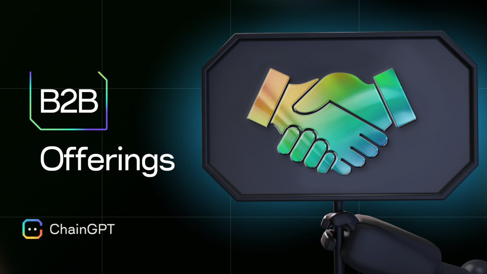

# B2B Offerings

<figure><figcaption></figcaption></figure>

### ChainGPT B2B Offerings

ChainGPT is an advanced AI infrastructure that develops cutting-edge AI-powered technologies for the Web3, Blockchain, and Crypto industries. Our mission is to enhance the Web3 space for both retail users and projects by creating AI-driven solutions that promote efficiency, security, and accessibility.&#x20;

#### Key Offerings:

* **ChainGPT AI Chatbot** (Telegram, Discord, Web)
* **AI-Generated News**
* **AI Smart Contracts Generator**
* **AI Smart Contracts Auditor**
* **AI NFT Generator**
* **AI Trading Assistant**
* **AI-Powered Security Extension**
* **AI Blockchain Analytics**
* **ChainGPT Pad** (Launchpad for AI-based projects)
* **DegenPad** (Launchpad for low FDV projects)
* **ChainGPT Labs** (We invest in AI!)
* **Incubation Program for AI Startups**
* **Launchpad Whitelabel Solution**

ChainGPT’s solutions are designed for both retail users and projects, providing open, accessible technologies to all. We encourage integration across the Web3 ecosystem by offering APIs and SDKs, ensuring that no project is excluded from accessing the powerful LLMs and applications we’ve developed.

***

#### ChainGPT AI Chatbot

<figure><figcaption></figcaption></figure>

Our AI Chatbot offers a valuable asset for Web3 projects looking to automate customer interactions and community engagement. The chatbot is capable of answering a range of inquiries, from live pricing data to market analysis, helping to reduce the workload on community managers. For projects needing a more customized approach, we offer a white-label version of the chatbot at competitive prices.

Integrating the Chatbot into your Telegram or Discord group is simple, requiring only the addition of the bot as a member—no admin permissions needed. This tool is free to use with a range of customizable features for partner projects.

[Learn more about our Chatbot here](https://docs.chaingpt.org/the-ecosystem/ai-tools-and-applications/ai-web3-chatbot)\
[Try the ChainGPT Bot on Telegram](https://t.me/ChainGPTAI\_Bot)

***

#### NFT Generator

<figure><figcaption></figcaption></figure>

ChainGPT’s AI-powered NFT Generator offers a powerful solution for Web3 projects looking to integrate seamless NFT creation and minting into their ecosystems. The generator enables users to produce and mint up to 10,000 NFTs directly on their chosen chain, making it an excellent tool for projects looking to scale their NFT offerings efficiently. With easy integration into partner NFT marketplaces, the NFT Generator simplifies the user experience and maximizes project reach.

Currently, the NFT Generator supports the following chains:\
**BNB Smart Chain, opBNB Mainnet, Scroll, Arbitrum One, Mantle, SKALE | Titan AI Hub, X Layer, COREDao, Sei, 5ire, Ethereum, Polygon, Avalanche, BTTC, Viction, Tron.**

This tool is perfect for NFT platforms and projects seeking to streamline their minting process.

[Learn more about the NFT Generator here](https://docs.chaingpt.org/the-ecosystem/ai-tools-and-applications/ai-nft-generator)

***

#### Dev Tooling (Smart Contract Generator & Smart Contract Auditor)

<figure><figcaption></figcaption></figure>

ChainGPT’s Dev Tooling equips projects with efficient, AI-powered tools for creating and securing smart contracts. The **Smart Contract Generator** allows developers to easily generate contracts tailored to their needs, offering a flexible foundation for projects of any size. In addition, the **Smart Contract Auditor** enhances security by providing a pre-emptive layer of protection, helping projects identify vulnerabilities and optimize contracts before deployment.

These tools are especially useful for projects engaged in frequent contract creation or looking to ensure security ahead of key launches.

[Learn more about the Smart Contract Generator here](https://docs.chaingpt.org/the-ecosystem/ai-tools-and-applications/ai-smart-contract-generator)\
[Learn more about the Smart Contract Auditor here](https://docs.chaingpt.org/the-ecosystem/ai-tools-and-applications/ai-smart-contract-auditor)

***

#### API / SDKs

<figure><figcaption></figcaption></figure>

ChainGPT’s suite of **APIs and SDKs** provides Web3 projects with the flexibility to integrate AI solutions into their platforms. Whether leveraging the API for quick, seamless integration or customizing the solution through SDKs, these tools enable projects to enhance operations, scalability, or user engagement with AI-driven capabilities.

[Explore ChainGPT's API/SDK offerings here](https://docs.chaingpt.org/the-ecosystem/apis-and-sdks)

***

#### ChainGPT Pad

<figure><figcaption></figcaption></figure>

[ChainGPT Pad](https://pad.chaingpt.org/) is a launchpad tailored to AI-based projects. With ChainGPT Pad, projects can efficiently raise funds and launch within the Web3 space, gaining exposure and access to a network of investors and partners.

***

#### DegenPad

<figure><figcaption></figcaption></figure>

[DegenPad](http://degenpad.com/) is the convergence of Web3 culture and high-stakes crypto.  It gives our community access to hidden gems by focusing on projects that align with emerging market trends, particularly those with low fully diluted valuations (FDVs).\

***

#### ChainGPT Labs

<figure><figcaption></figcaption></figure>

[ChainGPT Labs](https://labs.chaingpt.org/) is our investment arm, dedicated to supporting and incubating AI startups. Through our incubation program, we provide guidance, resources, and funding to help new AI-based projects succeed in the rapidly evolving Web3 environment.

***

### Contact Us

**General BD:**

Contact Person: Jacob Wallace

Contact Email: [jacob@chaingpt.org](mailto:jacob@chaingpt.org)
