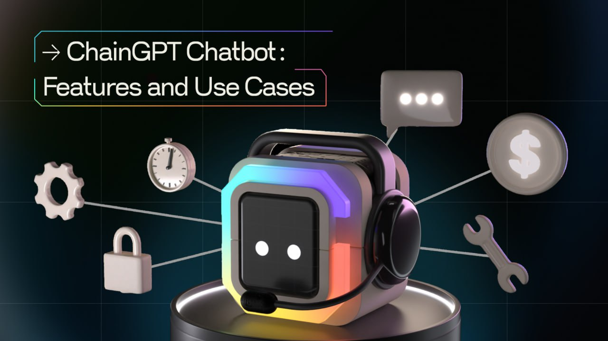

# AI Web3 Chatbot: Features and Use Cases

<figure><figcaption></figcaption></figure>

ChainGPT’s AI Web3 Chatbot delivers a robust B2B solution for businesses seeking to streamline customer engagement, automate support, and provide real-time insights. With seamless integration options and crypto-specific functionalities, it’s an essential tool for businesses operating in blockchain, Web3, and crypto industries.

**Key Features:**

1. **Flexible Integration Options**
   * Deployable on **Telegram** and **Discord** for free.
   * Customizable for proprietary platforms via our **SDK** and detailed technical documentation.
   * Supports embedding into websites, applications, and more, ensuring businesses can tailor functionality to meet unique needs.
2. **Crypto-Specific Knowledge Database**
   * Trained on vast data from blockchain, crypto, and Web3 industries.
   * Offers precise, industry-specific insights covering live market data, technical analysis, and regulatory trends.
   * Tailored to serve both novice users and seasoned experts.
3. **Real-Time Research and Market Insights**
   * Monitors Web3 activity to deliver timely, relevant information.
   * Supports traders with technical analysis, live pricing, and trending insights, enabling smarter decision-making.
4. **Community Management & Engagement**
   * Provides instant, accurate answers to community questions.
   * Offers entertaining and educational engagement, reducing the need for manual moderation.
   * Boosts activity through integrations like the **NFT Generator**, driving interactive competition and creativity.

***

### Customer Support and Community Management

<figure><figcaption></figcaption></figure>

Our chatbot autonomously educates and supports users, offering:

* Fast and accurate responses to community queries.
* Automated moderation tools for active communities.

Testimonial:\
\
&#xNAN;_"It has helped me become more active and eased the stress of constantly answering questions. It’s my go-to dictionary when users ask something I’m not sure about, making responses more confident and efficient."_ – Community Manager

**Enhanced User Engagement with NFTs**

The **NFT Generator** functionality drives excitement and organic growth in communities:

* Daily competitions create engaging experiences for Discord and Telegram users.
* Users actively compete to create stunning visuals, fostering community interaction.

Testimonial:\
\
&#xNAN;_"Our Telegram members topped activity charts with the NFT Generator, turning the global chat into a hub of creativity and friendly competition."_ – Telegram Community Admin

**Real-Time Research Assistance**

Empowering traders and businesses by consolidating crucial data:

* Real-time market data aggregation.
* Simplified technical analysis and actionable insights.

***

### Metrics and Statistics

* **100,000+ Total Users** | **10,000 New Users in the Last 30 Days**
* **62,000+ Unique Chats**
* **350,000+ NFTs Generated**
* Deployed in **50+ communities**, offering customized integrations and support.

***

### Security and Data Privacy

At ChainGPT, we prioritize user data protection:

1. **Secure Data Storage**
   * All data is housed in a private database with no public internet access, hosted on secure infrastructure (Render).
2. **Controlled Server Access**
   * Communication between Telegram and the bot server is encrypted and secured with unique secret keys.
3. **Minimal Data Exposure**
   * Only essential functionalities are exposed to minimize vulnerabilities.
4. **Privacy-First Design**
   * Data interactions are strictly limited to authorized components.
   * Feedback and improvements are ongoing, informed by community input.

***

### Pricing and Integration Options

* **Telegram and Discord**: Free to use with optional project-specific training.
* **SDK Integration**: Flexible options for advanced use cases, with API requests charged per usage (1 credit per request).

***

#### Contact & Feedback

We actively seek feedback to enhance chatbot capabilities. Here's what one user shared:\
&#xNAN;_"Using the chatbot and NFT Generator has boosted engagement and brought new life to our communities. It’s a game-changer for both users and admins."_

To integrate the ChainGPT Web3 Chatbot or schedule a demo:

* Contact us via Telegram: @JakeCGPT
