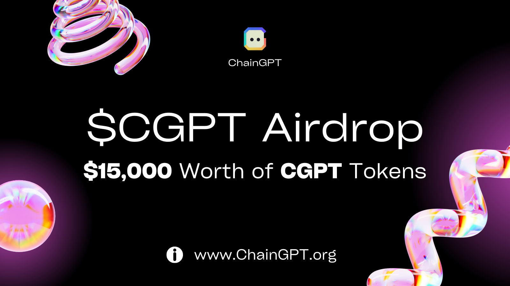

# 🟢 $15,000 Airdrop Campaign - by ChainGPT \[Ends May 10th]

**Welcome to ChainGPT's airdrop campaign!** We're excited to offer our community an opportunity to win a share of our $15,000 airdrop pool.

**💫 Enter The Giveaway**: [https://gleam.io/sF3C8/chaingpt-15000-worth-of-cgpt-airdrop](https://gleam.io/sF3C8/chaingpt-15000-worth-of-cgpt-airdrop)

📅 **Campaign Dates:** Live - Ending May 10th, 2023

<figure><figcaption></figcaption></figure>

**Here's how it works:** 1000 participants will be randomly selected to receive $10 worth of CGPT each. In addition, we're offering rewards for the top 50 referrers. The top referrer will receive $1500 worth of CGPT, with the second and third-place referrers receiving $750 and $400 worth of CGPT, respectively. The remaining 47 referrers in the top 50 will receive $50 worth of CGPT each.

Distribution of rewards will occur over a three-month period, with 33% of the reward being released each month. We will purchase CGPT tokens with stablecoin at the value they are at the date of distribution.

To participate in the airdrop campaign, simply follow the instructions on our website. Winners will be announced 30 days after launch, so be sure to keep an eye out for updates.

**Thank you for being a part of the ChainGPT community. Good luck!**

_----_

_Terms & Conditions: U.S. residents are not allowed to participate in this campaign, we will require winners to pass a KYC before we can issue their prize. Any participants that will cheat by using botted activity, fake accounts, false entries, etc, may be disqualified at any stage of the campaign._&#x20;
