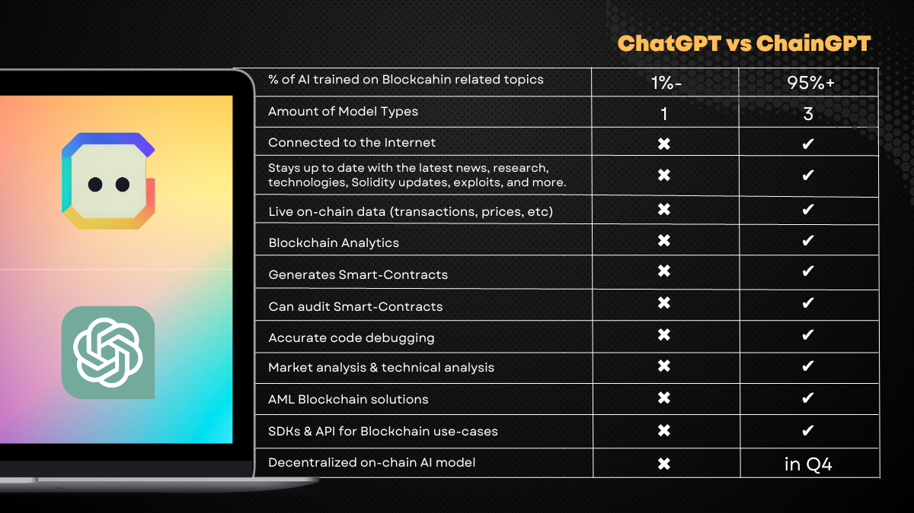

# ChatGPT vs ChainGPT

<figure><figcaption></figcaption></figure>

ChainGPT and ChatGPT offer different utilities and are tackling different use cases. ChainGPT is AI and Blockchain-focused, and ChatGPT on the other hand is a more general model. You can refer to the comparison diagram above, to truly understand the differences between both products and the use cases they were designed for.&#x20;
