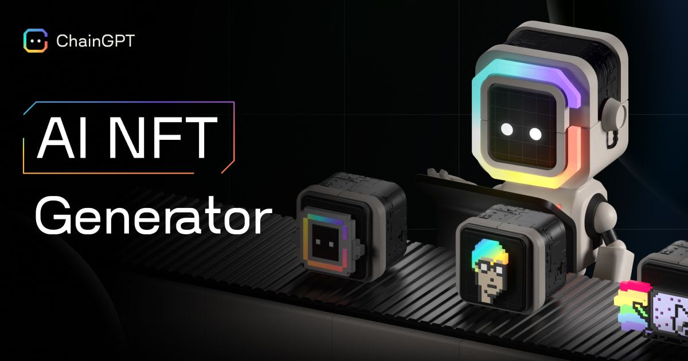

# AI NFT Generator


Interact with the ChainGPT AI NFT Generator here: [https://nft.chaingpt.org/](https://nft.chaingpt.org/)

A limited version of our NFT Generator is also available on [Telegram](https://t.me/chaingptai\_bot) & Discord.


<figure><figcaption></figcaption></figure>

Generative Art has become the frontier of self-expression, inviting a radical new category of creatives into the digital asset industry.&#x20;

ChainGPT has developed a generative AI model that expands beyond the Crypto, Blockchain, and Web3 space. The model has been neatly nestled into an intuitive user interface that maximizes creative process flexibility.&#x20;

### Generation Options

The ChainGPT AI NFT Generator allows for creating art in two distinct formats based on their supply parameters:

* **Option 1:** Single NFT
* **Option 2:** Collection

<figure><figcaption></figcaption></figure>

**Option 1: Single NFT:** \
Best for ultra-custom requests that benefit from individual maximal attention to detail and limitations in supply. Whether for an artist to express their thoughts or feelings through a visual medium or a business that needs abstract imagery for its content, ChainGPT’s single NFT generator option caters to the most complex demands with the highest quality results.

**Option 2: Collection:**\
The second option of generating collections is optimized to serve use cases where large batches of unique art are required. Some of the most prominent collection applications are for Ticketing and community building. Rather than mass printing un-inspiring, redundant copies of tickets, it is possible to provide your audience with unique yet distinguishable designs for their tickets. As it relates to the building of communities, collections based on a single prompt will carry the essence of a community uniformly throughout all of its pieces, creating a visual bond that unites all of its members under the same principle.

_\* Collections size will vary based on user preference/specification, with a maximum cap set at 10,000 images per request._

### Prompting

The ChainGPT AI NFT generator utilizes the familiar chat-based chat box interface that takes user text as inputs. Built to complement the most abstract thinkers and realize the imaginations of the most arbitrary concepts, there is no hardcoded universal framework for perfect prompting; the best prompts are those that produce the desired results.


For Prompt ideas, check out the ChainGPT Prompt Marketplace available in the Dapp dashboard: [https://app.chaingpt.org/promptmarket](https://app.chaingpt.org/promptmarket) or view the "all NFTs" tab in the generator [https://nft.chaingpt.org/](https://nft.chaingpt.org/) to get some inspiration from community creations


\---

[**Disclaimer**](../../misc/legal-docs/disclaimer.md)
