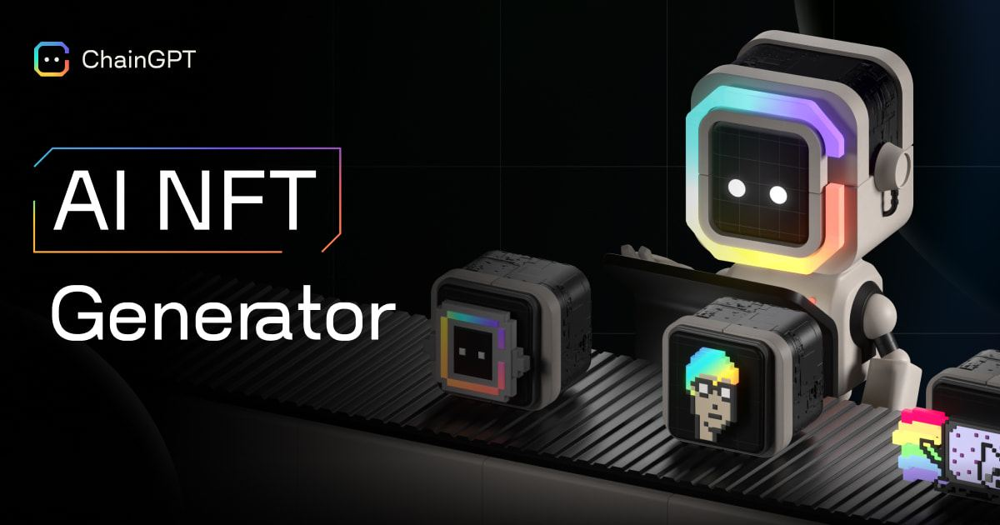

# AI NFT Generator


Interact with the ChainGPT AI NFT Generator here: [https://nft.chaingpt.org/](https://nft.chaingpt.org/)


<figure><figcaption></figcaption></figure>

Generative Art has become the frontier of self-expression that has invited a radical new category of creatives into the digital asset industry.&#x20;

ChainGPT has developed its own generative AI model that expands beyond the Crypto, Blockchain, and Web3 space. The model has been neatly nestled into an intuitive user interface that allows for maximal flexibility in the creative process.&#x20;

### Generation Options

The ChainGPT AI NFT Generator allows for creating art in two distinct formats based on their supply parameters:

**Option 1:** Single NFT\
**Option 2:** Collection

**Option 1: Single NFT**\
Best for ultra-custom requests that benefit from individual maximal attention to detail and limitations in supply. Be it for an artist to express their thoughts or feelings through a visual medium or a business that needs abstract imagery for its content, ChainGPT’s single NFT generator option caters to the most complex demands with the highest quality results.

**Option 2: Collection**\
The second option of generating collections is optimized to serve use cases where large batches of unique art are required. Some of the most prominent collection applications are for Ticketing and community building. Rather than having to mass print un-inspiring, redundant copies of tickets, it is possible to provide your audience with unique, yet distinguishable designs for their tickets. As it relates to the building on communities, collections that are bread from a single prompt will carry the essence of a community uniformly throughout all of its pieces; in turn creating a visual bond that unites all of its members under the same principle.

_\* Collections size will vary based on user preference/specification, with a maximum cap set at 10,000 images per request._

### Prompting

The ChainGPT AI NFT generator utilizes the familiar chat-based, chat box interface that takes user text as inputs. Built to complement the most abstract thinkers and realize the imaginations of the most arbitrary concepts, there is no hardcoded universal framework for perfect prompting; the best prompts are those that produce the desired results.


For Prompt ideas, check out the ChainGPT Prompt Marketplace available in the Dapp dashboard: [https://app.chaingpt.org/promptmarket](https://app.chaingpt.org/promptmarket) or view the "all NFTs" tab in the generator [https://nft.chaingpt.org/](https://nft.chaingpt.org/) to get some inspiration from community creations


\---

**DISCLAIMER**: _The information contained in our whitepaper and roadmap is provided for informational purposes only and should not be construed as financial advice or an inducement to purchase our utility token, $CGPT, for any purpose other than to interact with the ChainGPT AI bot, which is available at the time of the token sale. $CGPT is intended solely for use within the ChainGPT AI ecosystem, and we make no representations or warranties regarding the value, security, or suitability of $CGPT for any other purpose. We strongly encourage you to conduct due diligence and seek professional advice before making investment decisions. By accessing our whitepaper, website, and roadmap, you agree to release and hold us and our affiliates harmless from any liability for using the information.  In addition, please read our_ [Agreement for Sale of Tokens](https://www.chaingpt.org/licences).
