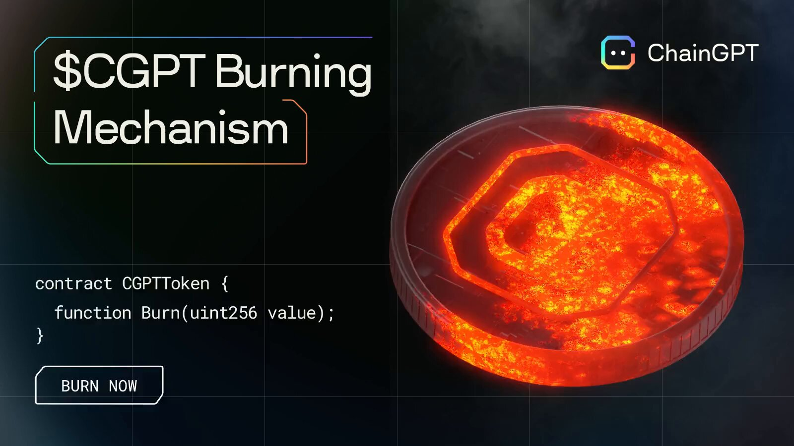

# Burn Mechanism

<figure><figcaption></figcaption></figure>

Acting as a key component of the $CGPT token's economic policy, burning is the process of reducing the circulating supply by sending the assets to a void, non-spendable address for which the private keys do not exist.


_On BNB chain's network (BSC {Binance Smart Chain}) the public void address utilized for this purpose is**`0x0000000000000000000000000000000000000000`**_


## How does the burn apply in ChainGPT?

Burning has been applied to every commercial-grade transaction taking place within the ChainGPT ecosystem. All of the touchpoints at which $CGPT is used for income generation will be tithed to the burn mechanism and, in turn, have every single user interaction contribute to the growth of the $CGPT ecosystem.&#x20;

### The Six Touchpoints of $CGPT's Fee Burn Mechanism

Six different vectors are tied to the burning.&#x20;

**Prompt Marketplace:** 100% burn \
_All of the fees paid within the prompt marketplace are removed from the circulating supply._\
\
**Chatbot & tools:** 50% burn \
_Half of all fees attributable to the Chatbot and any adjacent AI tools are removed from the circulating supply. The remaining half is accrued to the ChainGPT Foundation and DAO Treasury._\
\
**NFT Gen:** 50% burn \
_Half of all fees attributable to the AI NFT Generator are removed from the circulating supply. The remaining half accrues to the ChainGPT Foundation and DAO Treasury._\
\
**Pad:** 1% burn _(from raise amount)_  \
_Whenever a project hosts their IDO on the ChainGPT Pad, 1% of the amount it raises will be used to buy back $CGPT tokens from the open markets and burn them._\
\
**Whitelabel Solutions:** 10% buy-back & burn \
_Every time a B2B transaction takes place where another project or company decides to purchase any white label solutions/software/software licenses from ChainGPT, 10% of the total transaction cost will be used to buy back $CGPT tokens from the open markets and burn them._ \
\
**ChainGPT NFT Collection Sales:** 20% buy-back & burn\
_Any time ChainGPT sells its own NFTs, 20% of the proceeds will be used to buy back $CGPT tokens from the open markets and burn them._

\
Any $CGPT tokens are accrued back to ChainGPT, or the DAO will be distributed proportionately between the two entities and leveraged for purposes of development, marketing, and a slew of ancillary community and brand-building initiatives to propel ChainGPT.\

### Thesis

By reducing the units of tokens that are in circulation, the immediate pressure of scarcity reflects itself on market velocity, in turn exerting positive upward pressure on the unit valuation of the asset.

View All $CGPT token burns on BSC [explorer]

To view all previous $CGPT burn events on BSC's on-chain explorer, use the link provided below:&#x20;

[https://bscscan.com/token/0x9840652dc04fb9db2c43853633f0f62be6f00f98?a=0x0000000000000000000000000000000000000000](https://bscscan.com/token/0x9840652dc04fb9db2c43853633f0f62be6f00f98?a=0x0000000000000000000000000000000000000000)

\
\---

**DISCLAIMER**: The information contained in our roadmap is based on estimates and is not a guaranteed release schedule, and shall not be viewed as such.  _The information contained in our whitepaper and roadmap is provided for informational purposes only. It should not be construed as financial advice or an inducement to purchase our utility token, $CGPT, for any purpose other than to interact with the ChainGPT AI bot, which is available at the time of the token sale. $CGPT is intended solely for use within the ChainGPT AI ecosystem, and we make no representations or warranties regarding the value, security, or suitability of $CGPT for any other purpose. We strongly encourage you to conduct due diligence and seek professional advice before making investment decisions. By accessing our whitepaper, website, and roadmap, you agree to release and hold us and our affiliates harmless from any liability for using the information._&#x20;
