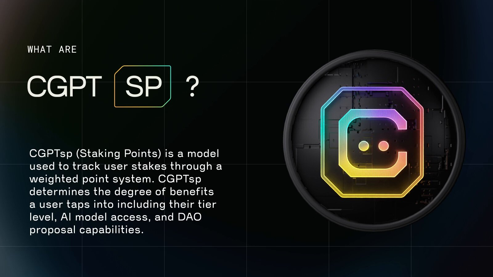

# CGPTsp (Staking Points)

<figure><figcaption></figcaption></figure>

### What are CGPTsp?

CGPTsp stands for ChainGPT staking points, a weighted accounting system used to determine the degree of commitment a user has to the ChainGPT ecosystem based on the factors of their total amount of tokens staked and the duration of their stakes.

### What is the purpose of CGPTsp?

CGPTsp plays a vital role in creating a balanced socioeconomic environment that gives less capitalized actors an opportunity to have a greater impact on the overall ecosystem.&#x20;

The more CGPTsp an account is attributed with, the more governance power it will have, the higher the tier in the ChainGPT Pad it will unlock, and the greater its opportunities for yield are.

### CGPTsp Calculation

The algorithm for calculating CGPTsp has been kept maximally simple, leveraging just two parameters: the total number of tokens and the pool specifications to which it is committed.

> Total $CGPT tokens staked **\*** the pool multiplier = Staking Points

**Token Weight:**\
_**One**_ staked $CGPT token equals _**one**_ staking point.

**Pool Multiplier Weight:**

Pool Multipliers are the weighted portion that is derived from the parameters of lockup durations and yield sizes; the longer the lockup, the higher the yield, the higher the multiplier.

**Pool Options:**\
ChainGPT offers a multitude of staking modules that each carry its own unique specifications and opportunities:

**45 days** = **1x** points multiplier | 1% APY\
**90 days** = **1.3x** points multiplier | 3% APY\
**180 days** = **1.5x** points multiplier | 5% APY\
**365 days** = **2x** points multiplier | 8% APY\
**365 days** = **2.5x** points multiplier | 0% APY

\---

**DISCLAIMER**: The information in our roadmap is based on estimates, is not a guaranteed release schedule, and shall not be viewed as such.  _The information contained in our whitepaper and roadmap is provided for informational purposes only. It should not be construed as financial advice or an inducement to purchase our utility token, $CGPT, for any purpose other than to interact with the ChainGPT AI bot, which is available at the time of the token sale. $CGPT is intended solely for use within the ChainGPT AI ecosystem, and we make no representations or warranties regarding the value, security, or suitability of $CGPT for any other purpose. We strongly encourage you to conduct due diligence and seek professional advice before making investment decisions. By accessing our whitepaper, website, and roadmap, you agree to release and hold us and our affiliates harmless from any liability for using the information._&#x20;
