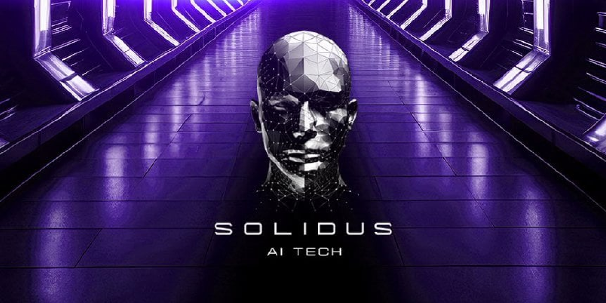

# Incubation Case Study: Solidus AI Tech

<figure><figcaption></figcaption></figure>

### What is Solidus AI Tech? 

Based in Europe, Solidus AI Tech is a Web3 infrastructure and AI services company that has built their own 8,000 square foot facility to house the hardware that provisions their computational services. They are developing a full stack of cutting-edge software solutions including Artificial-Intelligence-as-a-service (AIaaS), Blockchain-as-a-Service (BaaS), High Performance Computing power (HPC), and an Artificial Intelligence marketplace.

### What support ChainGPT has provided to Solidus AI Tech? 

As a provider of AI-powered infrastructure to the Web3 industry, ChainGPT stepped in to provide Solidus AI Tech with a full stack of technologies and advisory services to help them materialize their products and amplify their online presence. Beginning with our AI model and its deep domain expertise within the crypto, blockchain, and Web3 space, Solidus AI Tech plugged into our systems, streamlining their informational quality assurances and maximizing accuracy.

Through our incubator program's mentorship network, we opened doors and forged relationships with some of the industry's leading Venture Capital firms and decentralized service providers for Solidus AI Tech to integrate with. Leveraging ChainGPT's social media presence, we educated over 300,000 $CGPT community members about the potential of Solidus AI Tech. Spreading information far and wide proved successful in garnering attention for their project and attracting early supporters of their mission.

### Results

* **IDO participants:** 2,462 token buyers via ChainGPT Pad;
* **Funds raised via ChainGPT Pad IDO:** $160,000;
* **Funds raised via partner VCs**: $500,000+;
* **TGE results:** ATH 6x;
* **Community growth by:**\
  \
  Twitter: Before - 30,000 followers, After - 180,000 followers\
  Discord: Before - 7,000 members, After - 79,000 members\
  Telegram Chat: Before - 10,000 subscribers, After - 60,000 subscribers\
  Telegram News: Before - 10,000 subscribers, After - 60,000 subscribers\
  Telegram CIS: Before - 150 subscribers, After - 13,000 subscribers\
  Telegram Turkish: Before - 150 subscribers, After - 2,400 subscribers\
  Telegram Vietnamese: Before - 100 subscribers, After - 17,000 subscribers\
  Telegram Chinese: Before - 300 subscribers, After - 22,000 subscribers\
  YouTube: Before - 0 subscribers, After - 20,000 subscribers\
  LinkedIn: Before - 2,000 followers, After - 15,000 followers\

* **Launching on reputable pads:** ChainGPT Pad, Enjinstarter, TrustSwap, Decubate, Seedify.&#x20;
* **Listing on Centralized Exchanges (CEX):** MEXC, Gate, BitGet, BitMart, Poloniex & others.&#x20;
* **Tokenomics:** adjusted to market segment and project goals.&#x20;
* **Visual presence improvements:**

<figure><figcaption>
Solidus AI Tech Website Before
</figcaption></figure>

<figure><figcaption>
Solidus AI Tech Website After
</figcaption></figure>

* **Partner connections:**\
  BNB Chain, Kairon Labs, Kyber, ApeSwap, Thena, BiSwap, KCC, OKX Chain, Castrum, Unicrypt, GoPlus, Spicy Capital, FounderHeads, Ferrum, Decubate, Seedify, Star Protocol, Coinvestor, BitPanda, Baby Doge, zkSync, Laika AI, AITech, TaskOn, SpaceID, DotBit, ChainPort, PancakeSwap, AirNFTs, V3 Games, Fincake, chappyz, DCT, Metaverse, Openfabric, omnia, caduceus, Cryptomeda, HyperGPT, Open World, X-Metaverse, Polygon, Vauld, Cryptoiz, GameBoy, Karmaverse, Coveo Qubit, Samurai Versus,iGAMES, Acacia Digital, Indacoin, Born To Die, EDSX, Crowdcreate, Goldfingr, DexCheck, Brandless PH, ELLIPAL, Carbon, Mises, Plena, Assetux, CertiK.

### Review by Solidus AI Tech

_The ChainGPT team has played a pivotal role in our journey, offering invaluable support in various aspects of our business. They have been instrumental in helping us establish strategic partnerships with key players in the market, introducing and securing funding from venture capitalists, and providing guidance on a wide range of applications and tools. Their expertise in assisting us with the selection of key opinion leaders has been particularly impactful, enhancing our decision-making processes significantly._\
\
_What sets the ChainGPT team apart is their unwavering commitment to excellence. They consistently went above and beyond to ensure that our needs were not only met but exceeded. Their dedication to delivering exceptional service was evident in every interaction we had with them._\
\
_We are extremely grateful for the support from ChainGPT and look forward to continuing to collaborate with them in the future. Their contributions have been invaluable to our success, and we highly recommend their services to anyone seeking strategic support and expert guidance._

– Paul, Solidus AI Tech CEO

### Note by ChainGPT

Solidus AI Tech is among an ultra-exclusive select group of projects that have been accepted into the first generation of incubation by ChainGPT. The nature of their project within the category of artificial intelligence creates powerful synergies between them and us, leading to promising, fruitful, long-term relationships that transcend market cycles.

### Solidus AI Tech Resources 

_**General:**_ [_Website_](https://www.aitech.io/)\
&#xNAN;_**Docs:**_ [_Whitepaper_](https://docs.aitech.io/overview/i.-introduction) \
&#xNAN;_**Social Media:**_ [_Twitter_](https://twitter.com/AITECHio) _|_ [_Telegram_](https://t.me/solidusaichat) _|_ [_Discord_](https://discord.com/invite/solidusai)\

[**Disclaimer**](../../misc/legal-docs/disclaimer.md)
