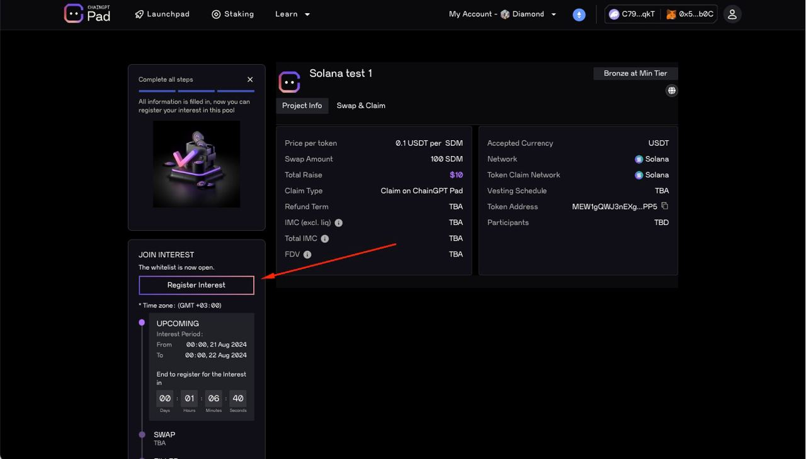

# Solana IDO Participation - Guide

This is a step-by-step guide on participating in Solana IDOs on ChainGPT Pad. **Please read the entire guide carefully before contacting our customer support team with questions.**

**Step #1:** To join IDOs on Solana, you must connect your EVM wallet that you usually use for IDOs and your Solana wallet using Phantom Wallet (it will automatically be connected and paired to your account; you won't have to pass a KYC or do anything else besides connecting your wallet).

**Step #2:** Once your Phantom wallet is connected, you must add your sub-wallets that can receive USDT on Solana (in case you choose to receive a refund) and a sub-wallet that can receive the IDO token. Adding those wallets is pretty easy, and there's a step-by-step guide below with screenshots of how to do it on desktop or mobile (please view the step-by-step guide).

**Step #3:** Register interest in IDO.

Using Mobile Device - Guide to connect with Phantom Wallet

#### Step 1: Log in to ChainGPT Pad using your KYC'd wallet via Phantom wallet. 

You must Import your EVM wallet to Phantom with the wallet you KYC'd and Staked $CGPT with.

#### Step 2: Go to your Phantom Wallet and click "USDT." 

Step 3: Click "More."

Step 4: Click "View on Solscan."

#### Step 5: Copy the address AFTER the forward-slash ( / ) in the search bar. 

#### Step 6: Click the "Connect Wallet" button on the IDO page and connect your EVM wallet. 

#### Step 7: Choose any network, then click "MetaMask." 

#### Step 8: Click "Connect Phantom" at the top of the IDO page. 

#### Step 9: Click "Phantom Wallet" at the bottom of the popup. 

#### Step 10: Click "Continue." 

#### Step 11: Click "Create Account." 

#### Step 12: Click "Confirm." 

#### Step 13: Paste the address from step 4 in the "Refund Token" box. 

#### Step 14: Click "Confirm." 

#### Step 15: Click "Confirm." 

#### Step 16: Now that you have connected your wallet, you can register interest for the IDO. 

(If you don’t see this screen, ensure you followed all the steps above correctly. If it still doesn’t appear, ask a CM for help in our [Telegram group](https://t.me/chaingpt) or [Discord](https://docs.chaingpt.org/the-ecosystem/chaingpt-pad/www.discord.gg/chaingpt).)

#### Step 17: From this point forward, the rest of the IDO will function as it does for all other chains. 

You should now be able to register your interest in the IDO.

\

Using Desktop/PC -  Guide to connecting with Phantom Wallet

### Step 1: Connect Phantom wallet.

### &#x20;Step 2: Click the "Continue button."

### Step 3: Click the "Create Account" button.

### &#x20;Step 4: Go to Phantom and press on the "USDT."

### Step 5: Press on "More."

### Step 6: Press "View on Solscan."

### Step 7: Copy the address after the slash in the search bar (without the slash).

### Step 8: Paste the address in the "Refund Token."

### Step 9: Press "Confirm."

### Step 10: Press "Confirm" in the MetaMask.

### Step 11: Now that you have connected your wallet, you can register interest in the IDO.&#x20;

(If you don’t see that screen, check that you followed all the steps correctly. If it still doesn’t appear, ask the CM on our [Telegram group](https://t.me/chaingpt) or [Discord](https://www.discord.gg/chaingpt) for help.)

### Step 12: From this point forward, the rest of the IDO will function as it does for all other chains. You should now be able to register your interest in the IDO.&#x20;

* How to create a Solana wallet using Phantom: [https://www.kucoin.com/learn/web3/how-to-create-a-phantom-wallet](https://www.kucoin.com/learn/web3/how-to-create-a-phantom-wallet)
