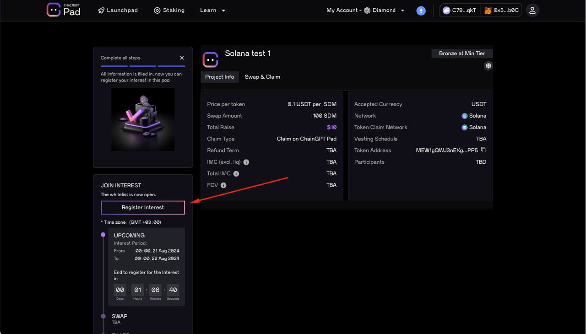

# Solana IDO Participation - Guide

This is a step-by-step guide on participating in Solana IDOs on ChainGPT Pad. **Please read the entire guide carefully before contacting our customer support team with questions.**

This is a step-by-step guide on participating in Solana IDOs on ChainGPT Pad. **Please read the entire guide carefully before contacting our customer support team with questions.**

**Step #1:** To join IDOs on Solana, you must connect your EVM wallet that you usually use for IDOs and your Solana wallet using Phantom Wallet (it will automatically be connected and paired to your account; you won't have to pass a KYC or do anything else besides connecting your wallet).

**Step #2:  hold at least** 0.01 USDT and 0.01 SOL in your Phantom wallet.&#x20;

**Step #3:** Once your Phantom wallet is connected, you must add your sub-wallets that can receive USDT on Solana (in case you choose to receive a refund) and a sub-wallet that can receive the IDO token. Adding those wallets is pretty easy, and there's a step-by-step guide below with screenshots of how to do it on desktop or mobile (please view the step-by-step guide).

**Step #4:** Register interest in IDO.

Using Mobile Device - Guide to connect with Phantom Wallet

#### Step 1: Log in to ChainGPT Pad using your KYC'd wallet via Phantom wallet. 

You must Import your EVM wallet to Phantom with the wallet you KYC'd and Staked $CGPT with.

#### Step 2: Go to your Phantom Wallet and click "USDT." 

Step 3: Click "More."

Step 4: Click "View on Solscan."

#### Step 5: Copy the address AFTER the forward-slash ( / ) in the search bar. 

#### Step 6: Click the "Connect Wallet" button on the IDO page and connect your EVM wallet. 

#### Step 7: Choose any network, then click "MetaMask." 

#### Step 8: Click "Connect Phantom" at the top of the IDO page. 

#### Step 9: Click "Phantom Wallet" at the bottom of the popup. 

#### Step 10: Click "Continue." 

#### Step 11: Click "Create Account." 

#### Step 12: Click "Confirm." 

#### Step 13: Paste the address from step 4 in the "Refund Token" box. 

#### Step 14: Click "Confirm." 

#### Step 15: Click "Confirm." 

#### Step 16: Now that you have connected your wallet, you can register interest for the IDO. 

(If you don’t see this screen, ensure you followed all the steps above correctly. If it still doesn’t appear, ask a CM for help in our [Telegram group](https://t.me/chaingpt) or [Discord](https://docs.chaingpt.org/the-ecosystem/chaingpt-pad/www.discord.gg/chaingpt).)

#### Step 17: From this point forward, the rest of the IDO will function as it does for all other chains. 

You should now be able to register your interest in the IDO.

\

Using Desktop/PC -  Guide to connecting with Phantom Wallet

### Step 1: Connect Phantom wallet.

### &#x20;Step 2: Click the "Continue button."

### Step 3: Click the "Create Account" button.

### &#x20;Step 4: Go to Phantom and press on the "USDT."

### Step 5: Press on "More."

### Step 6: Press "View on Solscan."

### Step 7: Copy the address after the slash in the search bar (without the slash).

### Step 8: Paste the address in the "Refund Token."

### Step 9: Press "Confirm."

### Step 10: Press "Confirm" in the MetaMask.

### Step 11: Now that you have connected your wallet, you can register interest in the IDO.&#x20;

(If you don’t see that screen, check that you followed all the steps correctly. If it still doesn’t appear, ask the CM on our [Telegram group](https://t.me/chaingpt) or [Discord](https://www.discord.gg/chaingpt) for help.)

### Step 12: From this point forward, the rest of the IDO will function as it does for all other chains. You should now be able to register your interest in the IDO.&#x20;

* How to create a Solana wallet using Phantom: [https://www.kucoin.com/learn/web3/how-to-create-a-phantom-wallet](https://www.kucoin.com/learn/web3/how-to-create-a-phantom-wallet)

\
**Step #1:** To join IDOs on Solana, you must connect your EVM wallet that you normally use for IDOs and your Solana wallet using Phantom Wallet (it will automatically be connected and paired to your account; you won't have to pass a KYC or do anything else besides connecting your wallet).

**Step #2:** Once your Phantom wallet is connected, you will need to add your sub-wallets that can receive USDT on Solana (in case you choose to receive a refund) and a sub-wallet that can receive the IDO token. Adding those wallets is pretty easy, and there's a step-by-step guide below with screenshots on how to do it on Desktop or on Mobile (please view the step-by-step guide).

**Step #3:** Register interest for the IDO.

### **Step-By-Step Guides:**

Solana IDO Registration - for Desktop

You must use your Phantom Wallet and MetaMask Wallet to participate in an IDO on Solana for ChainGPT Pad.&#x20;

For steps to set up Phantom Wallet, please view this [setup guide.](https://www.kucoin.com/learn/web3/how-to-create-a-phantom-wallet)

***

## Guide to connecting with Phantom Wallet:

### Step 1: Connect Phantom wallet.

### &#x20;Step 2: Click the "Continue button."

### Step 3: Click the "Create Account" button.

### &#x20;Step 4: Go to Phantom and press on the "USDT."

### Step 5: Press on "More."

### Step 6: Press "View on Solscan."

### Step 7: Copy the address after the slash in the search bar (without the slash).

### Step 8: Paste the address in the "Refund Token."

### Step 9: Press "Confirm."

### Step 10: Press "Confirm" in the MetaMask.

### Step 11: Now that you have connected your wallet, you can register interest in the IDO.&#x20;

(If you don’t see that screen, check that you followed all the steps correctly. If it still doesn’t appear, ask the CM on our [Telegram group](https://t.me/chaingpt) or [Discord](https://www.discord.gg/chaingpt) for help.)

### Step 12: From this point forward, the rest of the IDO will function as it does for all other chains. You should now be able to register your interest in the IDO.&#x20;

Solana IDO Registration - for Mobile

You must use your Phantom Wallet and MetaMask Wallet to participate in an IDO on Solana for ChainGPT Pad.&#x20;

For steps to set up Phantom Wallet, please view this [setup guide.](https://www.kucoin.com/learn/web3/how-to-create-a-phantom-wallet)

**Only for Mobile:** You must Import your EVM wallet to Phantom with the wallet you KYC'd and Staked $CGPT with.&#x20;

***

## Guide to connecting with Phantom Wallet:

### Step 1: Go to your Phantom Wallet and click "USDT."

\

### Step 2: Click "More."&#x20;

### Step 3: Click "View on Solscan."

\

### Step 4: Copy the address AFTER the forward-slash ( / ) in the search bar.&#x20;

### Step 5: Click the "Connect Wallet" button on the IDO page and connect your EVM wallet.

\

### Step 6: Choose any network, then click "MetaMask."

### Step 7: Click "Connect Phantom" at the top of the IDO page.

\

### Step 8: Click  "Phantom Wallet" at the bottom of the popup.&#x20;

### Step 9: Click "Continue."

\

### Step 10: Click "Create Account."

### Step 11: Click "Confirm."

### Step 12: Paste the address from step 4 in the "Refund Token" box.

### Step 13: Click "Confirm."

\

### 14) Click "Confirm."

\
\
Step 15: Now that you have connected your wallet, you can register interest for the IDO. (If you don’t see this screen, ensure you followed all the steps above correctly. If it still doesn’t appear, ask a CM for help in our [Telegram group](https://t.me/chaingpt) or [Discord](https://www.discord.gg/chaingpt).)

\

### Step 16: From this point forward, the rest of the IDO will function as it does for all other chains. You should now be able to register your interest in the IDO.&#x20;

\
\

How to Create a Phantom Wallet for the Solana Ecosystem - a Tutorial by KuCoin

## How to Create a Phantom Wallet for the Solana Ecosystem - a Tutorial by KuCoin

Original Tutorial Link: [https://www.kucoin.com/learn/web3/how-to-create-a-phantom-wallet](https://www.kucoin.com/learn/web3/how-to-create-a-phantom-wallet)&#x20;

Discover how to quickly and securely set up a Phantom wallet, your gateway to the Solana blockchain. Learn about its key features, security measures, and tips for safely managing your digital assets. Ideal for both crypto newcomers and seasoned enthusiasts.

Phantom Wallet has rapidly become a go-to [digital wallet](https://www.kucoin.com/learn/crypto/what-is-a-crypto-wallet) for users within the [Solana ecosystem](https://www.kucoin.com/learn/crypto/top-crypto-projects-in-solana-ecosystem), heralded for its user-friendly interface and robust security features. As of January 2024, Phantom enjoyed 3.2 million monthly active users (MAUs), a 220% YoY growth propelled by the rising [on-chain](https://www.kucoin.com/learn/glossary/on-chain) activity on the [Solana](https://www.kucoin.com/price/SOL) network.&#x20;

### What Is Phantom Wallet?

Phantom Wallet is a versatile and user-friendly [Web3 wallet](https://www.kucoin.com/learn/web3/guide-to-top-web3-wallets) that supports a range of functionalities catering to both novice and experienced cryptocurrency users. Initially established as a wallet primarily for Solana, Phantom has expanded its services to include [Ethereum](https://www.kucoin.com/price/ETH), [Polygon](https://www.kucoin.com/price/MATIC), and even [Bitcoin](https://www.kucoin.com/price/BTC) networks, making it a multi-chain wallet. The wallet allows users to store, send, and receive cryptocurrencies and tokens, engage with decentralized applications ([dApps](https://www.kucoin.com/learn/glossary/dapp)), and manage non-fungible tokens ([NFTs](https://www.kucoin.com/markets/nft))​​.  One of the standout features of Phantom Wallet is its ability to conduct in-app [token swaps](https://www.kucoin.com/learn/glossary/token-swap) across Ethereum, Polygon, and Solana networks, providing convenience and efficiency in asset management. It also supports [cryptocurrency staking](https://www.kucoin.com/blog/what-is-staking-and-how-does-it-work), particularly for SOL tokens, allowing users to earn rewards by participating in the Solana network's operations​​.

&#x20;

Phantom wallet vs. other Solana wallets | Source: Phantom.app&#x20;

&#x20;

Launched to cater to the growing demand for Solana-based transactions, Phantom makes it easy to store, send, and receive SOL and other SPL tokens. It also serves as a seamless gateway to dApps on the Solana blockchain, offering functionalities like [staking](https://www.kucoin.com/earn), swapping tokens, and NFT management directly within the wallet.

&#x20;

Phantom places a strong emphasis on security with its [self-custodial](https://www.kucoin.com/blog/the-difference-between-custodial-and-non-custodial-crypto-wallets) approach, ensuring users have full control over their assets without third-party interference. The wallet is designed with privacy in mind, requiring no personal information for usage. It also includes scam detection to flag malicious transactions and offers integration with [Ledger](https://www.kucoin.com/learn/glossary/ledger) [hardware wallets](https://www.kucoin.com/blog/the-usage-of-hardware-wallets-in-crypto) for an added layer of security​​​​.

&#x20;

**Explore the** [**best Solana wallets**](https://www.kucoin.com/learn/web3/the-best-solana-wallets-list) **beyond Phantom.**&#x20;

&#x20;

### Setting Up a Phantom Wallet: A Step-by-Step Guide

Getting started with Phantom might seem daunting to those new to the world of cryptocurrencies. However, with the right guidance, the process becomes straightforward. Here’s a step-by-step guide on how you can set up a Phantom wallet for accessing the Solana network:&#x20;

&#x20;

#### Step 1. Choose Your Platform

Visit the [official website of Phantom](https://phantom.app/) wallet and download the extension for your browser (Chrome, Firefox, Brave).

&#x20;

&#x20;

If you want to use the mobile app, download the Phantom app from the App Store (iOS) or Google Play (Android).

&#x20;

#### Step 2. Create a New Phantom Wallet

Image source: Phantom.app&#x20;

&#x20;

Open Phantom and click "Create a new wallet." Choose a strong password and write down your [seed phrase](https://www.kucoin.com/learn/glossary/seed-phrase) carefully. Never share your seed phrase with anyone! Confirm your seed phrase for backup.

&#x20;

**Importing an Existing Wallet**

If you already have a Phantom wallet and wish to access it on a new device or browser, you can easily import it:

&#x20;

1. **Select 'Import Existing Wallet':** In the Phantom extension, choose the option to import an existing wallet.
2. **Enter Your Secret Recovery Phrase:** Input the secret recovery phrase associated with your existing Phantom wallet. Ensure you enter the phrase correctly to gain access to your wallet.
3. **Set a New Password:** Create a new strong password for accessing your wallet on the new device or browser.

&#x20;

#### Step 3. Secure Your Account

Image source: Phantom.app&#x20;

&#x20;

Set up two-factor authentication (2FA) for added security. Consider exporting your private key for advanced users (optional).

&#x20;

**Learn how to**[ **back up your crypto wallet’s private keys**](https://www.kucoin.com/blog/how-to-back-up-your-crypto-wallet-private-keys) **securely.**

&#x20;

#### Step 4. Add SOL to Your Phantom Wallet

Image source: Phantom.app&#x20;

&#x20;

There are several ways to add SOL to your wallet:

&#x20;

1. **Buy SOL directly within Phantom:** Click "Buy SOL" and choose your preferred payment method.
2. **Transfer SOL from exchange:** Click "Deposit SOL" and enter the sending wallet address. You can [buy SOL on KuCoin](https://www.kucoin.com/how-to-buy/solana) and transfer to your Phantom wallet to fund it.&#x20;

#### 

### Exploring Phantom Wallet Features

Once your Phantom wallet is set up, you can explore its array of features:

&#x20;

* **Storing Cryptocurrencies:** Phantom functions as a secure crypto wallet, allowing you to store, send, and receive cryptocurrencies like Solana's native token SOL, alongside other Solana-based tokens.
* **Interacting with dApps:** Connect your Phantom wallet to various dApps, and participate in DeFi ([Decentralized Finance](https://www.kucoin.com/learn/web3/what-is-decentralized-finance-defi)) protocols, NFT marketplaces, play [blockchain games](https://www.kucoin.com/learn/web3/top-gaming-gamefi-coins-to-watch), and more.
* **Swapping Tokens:** Transfer SOL and other Solana tokens between your Phantom wallet and other wallets or exchanges. You can easily copy your wallet address to receive crypto or generate QR codes to facilitate quick transfers.
* **Managing NFTs:** Phantom provides a user-friendly interface to view and manage your Solana-based NFTs. You can showcase your NFT collection within the wallet and easily track their ownership details.
* **Staking SOL:** Participate in Solana's staking mechanism to earn rewards. Here’s a guide on [how to stake SOL on Phantom](https://www.kucoin.com/learn/crypto/ultimate-guide-to-staking-solana-sol) wallet.&#x20;
* **Exploring the Solana Ecosystem:** Your Phantom wallet offers an "Explore" section that helps you discover new and trending dApps, NFT marketplaces, and DeFi protocols within the Solana ecosystem.
* **Cold Storage for Cryptos:** For enhanced security, Phantom wallets allow integration with hardware wallets like Ledger, enabling offline storage of your [private keys](https://www.kucoin.com/learn/glossary/private-key).

### Conclusion

Setting up a Phantom wallet is a straightforward process that unlocks a world of opportunities within the Solana ecosystem. Whether you're creating a new wallet or importing an existing one, Phantom's emphasis on security and its user-friendly interface makes it an invaluable tool for engaging with cryptocurrencies and dApps. Remember, the security of your digital assets is in your hands, so always manage your passwords and recovery phrases with care.

&#x20;

### Further Reading&#x20;

1. [The Best Solana Wallets for 2024](https://www.kucoin.com/learn/web3/the-best-solana-wallets-list)
2. [Top Solana Memecoins to Watch in 2024](https://www.kucoin.com/learn/crypto/top-solana-memecoins-to-watch)
3. [Top 5 Decentralized Exchanges (DEXs) in the Solana Ecosystem](https://www.kucoin.com/learn/web3/top-decentralized-exchanges-dexs-in-the-solana-ecosystem)
4. [Top Projects in the Solana Ecosystem to Watch](https://www.kucoin.com/learn/crypto/top-crypto-projects-in-solana-ecosystem)
5. [How to Stake Solana with Phantom Wallet](https://www.kucoin.com/learn/crypto/ultimate-guide-to-staking-solana-sol)
6. [What Is a Crypto Wallet, and How to Choose the Best One for You](https://www.kucoin.com/learn/crypto/what-is-a-crypto-wallet)
7. [A Guide to Top Web3 Wallets of the New Decentralized Internet Era](https://www.kucoin.com/learn/web3/guide-to-top-web3-wallets)

### Phantom Wallet FAQs

#### 1. What Is Phantom Wallet Used for?

Phantom Wallet is designed as a non-custodial, multichain Web3 wallet that supports Solana, Ethereum, and Polygon networks. It allows users to manage their cryptocurrencies and NFTs, engage in staking Solana, swap tokens, and access a variety of DeFi applications directly from the wallet. It functions as a browser extension and is also available on iOS and Android mobile devices, facilitating a seamless interaction with the digital asset ecosystem​​​​.

&#x20;

#### 2. Is Phantom Wallet Safe?

Phantom Wallet is considered safe for managing digital assets at the blockchain level, offering high security as a hot wallet optimized for routine transactions. It focuses on protecting users against malicious attacks, including phishing and spam NFTs. However, like any [hot wallet](https://www.kucoin.com/learn/glossary/hot-wallet) connected to the internet, it's susceptible to risks.&#x20;

&#x20;

An incident in August 2022 saw several Solana wallets, including Phantom, being compromised due to vulnerabilities related to a third-party service, not Phantom's security systems directly. It's recommended to exercise caution and consider using cold wallets for storing large amounts of assets​​​​.

&#x20;

#### 3. Can Phantom Wallet Store Bitcoin?

Yes, Phantom Wallet supports Bitcoin, allowing users to buy, sell, trade, transfer, and hold BTC, [Ordinals](https://www.kucoin.com/learn/crypto/the-world-of-bitcoin-nfts-ultimate-guide-to-ordinals), and [BRC-20 tokens](https://www.kucoin.com/blog/demystifying-brc20-kucoin-deep-dive-into-memecoin-machine) within the wallet. It offers full Bitcoin support and facilitates easy management of Bitcoin addresses, including both Native [SegWit](https://www.kucoin.com/learn/glossary/segwit) and [Taproot](https://www.kucoin.com/learn/glossary/taproot) addresses.&#x20;

&#x20;

You can toggle between these address types for transactions and managing Ordinals and BRC-20 tokens. This expansion into Bitcoin support aims to provide a comprehensive and user-friendly experience for managing a variety of digital assets across multiple blockchains, including Solana, Ethereum, and now Bitcoin, all within a single wallet interface​​​​​​.

&#x20;

#### 4. How to Change Phantom Wallet Password

To change your Phantom Wallet password, you have a couple of options depending on whether you are already logged in or if you've forgotten your password:

&#x20;

i. **If You've Forgotten Your Password:** Use the "Forgot Password" link found below the password field on the Phantom extension or app login screen. You'll need to reset your wallet using your Secret Recovery Phrase. This process will require you to uninstall and reinstall the Phantom app on mobile devices or use the "Reset Secret Phrase" option on the extension. After re-importing your wallet with the Secret Recovery Phrase, you can set a new password​​​​. [Click here](https://help.phantom.app/hc/en-us/articles/4406393769875-What-if-I-forgot-my-Phantom-password) for more information on this.&#x20;

&#x20;

ii. **If You Remember Your Password and Want to Change It:** Log in to your Phantom wallet. Navigate to Settings and look for the option to change your password.

&#x20;

You'll be prompted to enter your current password and then create a new one. Ensure the new password is strong and secure. After entering and confirming your new password, save your changes to update your wallet's password​​​​.

&#x20;

Remember, your Phantom wallet's security relies on the strength of your password and the safekeeping of your Secret Recovery Phrase. Always store your recovery phrase in a secure and private place.

&#x20;

#### 5. Is Phantom a Cold or Hot Wallet?

Phantom Wallet is categorized as a hot wallet. It's designed to be connected to the internet, enabling easy transactions and interactions with decentralized applications and services on the blockchain. While providing convenience for daily use and access to the [DeFi ecosystem](https://www.kucoin.com/markets/defi), users are encouraged to complement their Phantom Wallet with a hardware (cold) wallet for additional security, especially for significant amounts of cryptocurrencies​​​​.

&#x20;

