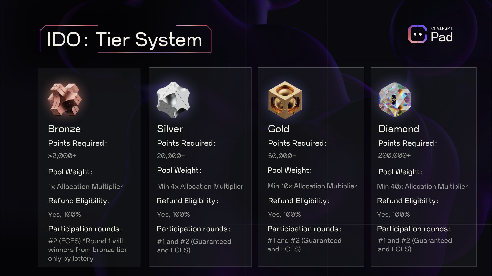

# Tier System

In order to maintain maximal fairness among all users, ChainGPT employs a simple four-tier system for the ChainGPT Pad. This is the exact same tier model that is applicable to the general ecosystem which can be found here: <mark style="color:blue;">**Link to tier System & Benefits**</mark>&#x20;

<figure><figcaption></figcaption></figure>

🥉 Bronze Tier

_This entry-level tier is explicitly designed for users with limited capital capacities._&#x20;

_**Points Required:** >2,000+_\
\
_**ChainGPT AI Ecosystem Benefits:**_\
_- Freemium AI Tools Access: No_\
_- DAO Voting Rights: Yes_\
_- Can Create DAO Proposals: No_\
_- Free Incubation Airdrops: No_\
_- Early Access to ChainGPT Apps: No_\
\
_**ChainGPT Pad Benefits:**_\
\- _Pool Weight: 1x Allocation Multiplier_\
\- _Refund Eligibility: Yes, 100%_\
\- _Participation rounds: #2 (FCFS)_&#x20;

The Bronze tier does not provide access to the _**first/guaranteed round.** M_embers in this tier group are granted the right to only participate in the second/FCFS (First-Come-First-Serve) round. Occasionally, social campaigns (via Gleam / Galxe / TaskOn) will be launched in tandem with new IDO releases that will allow bronze-tier members to earn whitelist allocations for the first rounds.

🥈 Silver Tier

### 🥈 Silver Tier

_Silver is the second level tier and the first one that provides guaranteed access to the first round of participation in IDOs._

_**Points Required:** 20,000+_\
\
_**ChainGPT AI Ecosystem Benefits:**_\
_- Freemium AI Tools Access: No_\
_- DAO Voting Rights: Yes_\
_- Can Create DAO Proposals: No_\
_- Free Incubation Airdrops: No_\
_- Early Access to ChainGPT Apps: No_\
\
_**ChainGPT Pad Benefits:**_\
\- _Pool Weight: Minimum 4x Allocation Multiplier_\
\- _Refund Eligibility: Yes, 100%_\
\- _Participation rounds: #1 and #2 (Guaranteed and FCFS)_

The most commonly sought-after level due to the inclusion into all IDO rounds. Silver tier members are also granted a guaranteed whitelist placement for the launch of ChainGPT's official NFT collection.

🥇 Gold Tier

### 🥇 Gold Tier

_Gold is the second highest tier and the first one that provides access to premium early-stage crowdfunding and private sales._

_**Points Required:** 50,000+_\
\
_**ChainGPT AI Ecosystem Benefits:**_\
_- Freemium AI Tools Access: No_\
_- DAO Voting Rights: Yes_\
_- Can Create DAO Proposals: No_\
_- Free Incubation Airdrops: Yes_\
_- Early Access to ChainGPT Apps: Yes_\
\
_**ChainGPT Pad Benefits:**_\
\- _Pool Weight: Minimum 10x Allocation Multiplier_\
\- _Refund Eligibility: Yes, 100%_\
\- _Participation rounds: #1 and #2 (Guaranteed and FCFS)_

In the Gold Tier, benefits for members expand to include opportunities for participating in pre-public stages of new project launches (private sales). Likewise, the Gold tier members will be guaranteed whitelist placements for participating in the official ChainGPT NFT collection launch.

One of the most appealing drivers of the Gold tier is the unlocked IDO allocation claims. For every IDO launched on ChainGPT Pad, a portion of the tokens collected will be distributed among gold & diamond tier members.

💎 Diamond Tier

_Diamond is the highest and most desirable tier for launchpad participants, given the breadth of benefits it offers. Being the only tier that provides complementary tokens & NFT airdrops, Diamond tier users are reimbursed for their commitments passively._

_**Points Required:** 200,000+_\
\
_**ChainGPT AI Ecosystem Benefits:**_\
_- Freemium AI Tools Access: Yes_\
_- DAO Voting Rights: Yes_\
_- Can Create DAO Proposals: Yes_\
_- Free Incubation Airdrops: Yes_\
_- Early Access to ChainGPT Apps: Yes_\
\
_**ChainGPT Pad Benefits:**_\
\- _Pool Weight: Minimum 40x Allocation Multiplier_\
\- _Refund Eligibility: Yes, 100%_\
\- _Participation rounds: #1 and #2 (Guaranteed and FCFS)_

As with earlier (non-bronze) levels, members of the Diamond tier receive access to both IDO rounds. Likewise with the preceding Gold Tier, one of the most appealing drivers for Diamond tier members is the unlocked IDO allocation claims. For every IDO launched on ChainGPT Pad, a portion of the tokens collected will be distributed among Gold & Diamond tier members. Of course, the proportional allocation is more significant for higher-tier members.

Diamond tier members also receive additional incentives from the ChainGPT partnership network through priority NFT distributions and private token allocations.

The Diamond Tier is the only one that pushes the benefits beyond the realm of the ChainGPT Pad and into other vectors of ChainGPT's ecosystem, namely Freemium tools and DAO proposal rights.&#x20;

Here, members are automatically granted unlimited access to all ChainGPT AI tools and receive monthly CGPTc balance refills of up to 20,000 credits. Thereby incentivizing membership at his level with ecosystemic participation in every possible manner.

Diamond Tier members also happen to be the only group of community members who are endowed with the ability to submit proposals. While any $CGPT token holder is allowed to participate in steering the outcomes of decisions, only Diamond Tier members can push the suggestions for community deliberations.

<figure><figcaption></figcaption></figure>

***

### Point System:

_The Point system is a method of calculating the impact a user’s stake has on their participation._

Points within the tier system act as a mechanism to track the degree of a user’s commitment/reputation within the ChainGPT ecosystem and attribute accurate amplification weights to the staking user’s allocation rights.

In an attempt to retain maximal simplicity and efficiency, points are calculated by taking the amount of tokens staked and multiplying them by the stake pool

_Total $CGPT tokens staked **\*** the pool multiplier = Tier Points_

_**1 staked $CGPT = 1 tier point**_

If a user stakes _**1,000 $CGPT**_ into a _**45-day pool**_, they have _**1,000 Tier points**_\
If a user stakes _**1,000 $CGPT**_ into a _**90-day pool**_, they have _**1,300 Tier points**_\
If a user stakes _**1,000 $CGPT**_ into a _**180-day pool**_, they have _**1,500 Tier points**_\
If a user stakes _**1,000 $CGPT**_ into a _**365-day pool**_, they have _**2,000 Tier points**_

***

### **Tier Allocation Multiplier**

Allocation multipliers are the parameter that dictates the absolute size of a user's allocation is relative to the total token allocation (as measured by the base 1x multiplier available for bronze tier members.

_**Bronze Tier**_ multiplier is fixed at _**1x**_ for all participants, regardless of whether they have 2,000 points or 10,000 points.

However, in the upper three tiers of Silver, Gold, and Diamond, multipliers are scaled proportionately within their according tier ranges according to the size of the stake/amount of points and the relative positioning of those points leading up to the next tier.

**Examples of two people in 🥈 Silver tier:**

Bobby has exactly _**20,000 points**_ from staking; his multiplier is _**4x.**_\
Sally has _**35,000 points**_ from staking; her multiplier is _**7x**_.

Examples of two people in 🥇Gold tier:

Robert has exactly _**50,000 points**_ from staking; his multiplier is _**10x**_.\
Georgette has _**100,000**_ points from staking; her multiplier is _**20x**_.

Examples of two people in 💎 Diamond tier:

Garry has exactly _**200,000 points**_ from staking; his multiplier is _**40x**_.\
Elizabeth has _**400,000**_ points from staking; her multiplier might be _**50x**_.

_Due to the theoretically limitless capacity of a Diamond Tier staker, the multiplier is correlated logarithmically based on the final outcome of each IDO._


A minimal bronze-tier level is required in order to be admitted to the launchpad IDOs.



Every tier is capable of requesting a refund, and the refunds are 100% of the allocated capital.


\---

**DISCLAIMER**: The information contained in our roadmap is based on estimates and is not a guaranteed release schedule, and shall not be viewed as such.  _The information contained in our whitepaper and roadmap is provided for informational purposes only and should not be construed as financial advice or an inducement to purchase our utility token, $CGPT, for any purpose other than to interact with the ChainGPT AI bot, which is available at the time of the token sale. $CGPT is intended solely for use within the ChainGPT AI ecosystem, and we make no representations or warranties regarding the value, security, or suitability of $CGPT for any other purpose. We strongly encourage you to conduct due diligence and seek professional advice before making investment decisions. By accessing our whitepaper, website, and roadmap, you agree to release and hold us and our affiliates harmless from any liability for using the information contained therein.  In addition, read our_ [Agreement for Sale of Tokens](https://www.chaingpt.org/licences).
