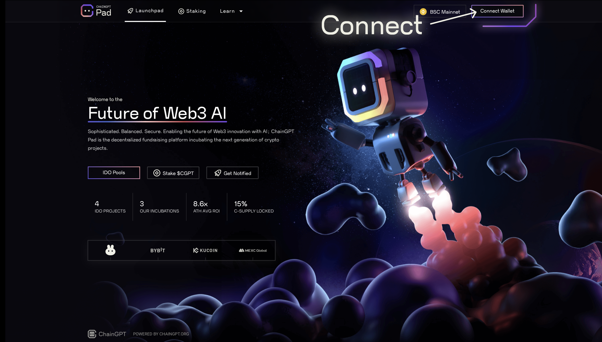

# KYC Onboarding Guide

> ChainGPT's launchpad conducts due diligence processes on behalf of both the projects that are listed and the users that will be participating. In order to maintain the highest level of integrity and ensure quality control (by disincentiving Sybil takeover attempts), KYC has been implemented to verify the identities of all users. \
> \
> This is a user guide for preparing to participate in the ChainGPT Pad.

<figure><figcaption></figcaption></figure>

**Quick Start Guide:**\
_1) Go to the official website_ [_**Pad.chaingpgt.org**_](http://pad.chaingpgt.org/)\
_2) Connect Web3 Wallet (Metamask, Trust, Rainbow, BSC wallet, etc. via WalletConnect)_\
_3) Navigate to My Profile_\
_4) Establish Account Status_\
_5) Click on "KYC Now"_\
_6) Submit Information_\
_7) Allow for processing_\
_8) Check for Status update_

### **1. Go to ChainGPT Pad Official Website**

Head over to the [_**Pad.chaingpgt.org**_](http://pad.chaingpgt.org/) website.

<figure><figcaption>
CHAINGPT PAD OFFICIAL LANDINGPAGE
</figcaption></figure>

_\* We recommend bookmarking the page to ensure that you_ always safely navigate to the official Pad website and avoid _potential phishing attempts._

### **2. Connect Wallet**

Once on the landing page, click _**“Connect Wallet”**_ at the top right of the screen.

<figure><figcaption></figcaption></figure>

A pop-up will appear with three actions to prompt:

**1)** Check the box to accept the Terms and Conditions,\
**2)** Choose the Network _(every IDO will have its own specifications, so select the one that is relevant to the native chain the project you wish to participate in is using)_.\
**3)** Select your wallet provider.

<figure><figcaption></figcaption></figure>

Immediately after, a signature request will pop up and prompt you to sign the message.

Select "sign" to let the wallet connect.

<figure><figcaption></figcaption></figure>

### **3. Navigate to “My Profile”**

Immediately after the wallet connection is established, a new drop-down button titled "My Account" will appear as a menu option on the top next to the Network.

Click on that new dropdown menu.

<figure><figcaption></figcaption></figure>

Select the _**“My Profile”**_ option.

<figure><figcaption></figcaption></figure>

### **4. Establish Account Status**

Arriving at your profile page, you will immediately be able to see your account status on the upper right side under the _**"Account Information"**_ label.

<figure><figcaption></figcaption></figure>

### **5. Click KYC Now**

On the bottom panel of the profile page, you will see three columns; select the second/middle column and click on the _**"KYC Now"**_ button. That will take you to the secured interface.&#x20;

<figure><figcaption></figcaption></figure>

### **6. Submit Information**

As you arrive at the KYC onboarding page _(conducted by our partner and industry-leading provider Blockpass)_, you will be prompted to fill out a standardized form with your information, a document upload, and your dedicated Web3 wallet.

<figure><figcaption></figcaption></figure>

_\* Be sure to provide the same wallet address you originally connected to the ChainGPT Pad; one on-chain wallet address per user._

### **7. Wait for Processing**

After completing the form, you will receive a confirmation at the email address you provided to let you know everything is being processed.&#x20;

On average, Blockpass requires up to 48 hours to process your information.&#x20;

You will be kept updated about the status of your applications via email.

### **8. Updated Account Status — Welcome!**

As soon as Blockpass successfully processes your form, your profile dashboard will automatically be updated.&#x20;

Monitor the page for the account status switch from a red “_unverified_” to a green “_verified_”

<figure><figcaption></figcaption></figure>


_\*note\*_\
_KYC accounts are required to have a tier level that is acquired through the accumulation of points via the staking modules. If you do not stake $CGPT tokens, you will not have a chance to participate._


\---

[**Disclaimer**](../../misc/legal-docs/disclaimer.md)
