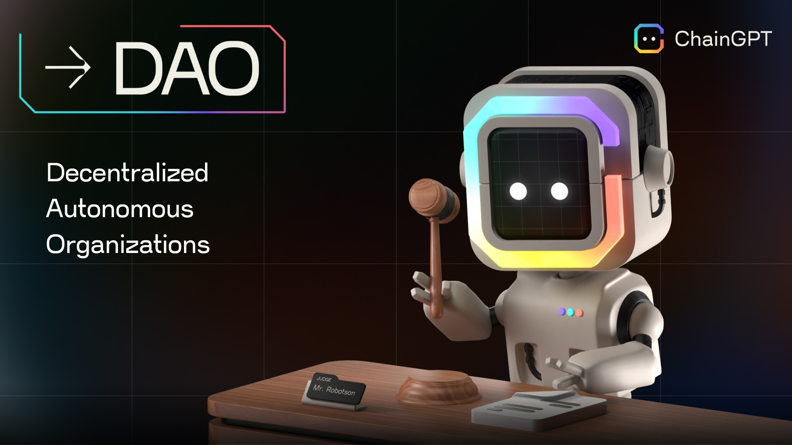

# DAO Governance

<figure><figcaption></figcaption></figure>

**Visit ChainGPT's DAO:** [https://dao.chaingpt.org ](https://dao.chaingpt.org)

## Governance Introduction

The ChainGPT DAO is the vehicle for supporting decision-making regarding the development and direction of the project. It is the focal point for rallying the community around important decisions and coordinating member efforts to enable or deny any changes from taking place.

Every member of the ChainGPT DAO has the unique ability to contribute their thoughts and exert influence over how ChainGPT's products are built, what path they travel, and many other technical matters.

<figure><figcaption></figcaption></figure>

**How to become a DAO Member:**

The user journey of Induction into the ChainGPT DAO starts when they accrue the $CGPT token.&#x20;

Becoming a DAO member has been made maximally accessible by introducing a 1-token threshold level. That means in order to become a member with a degree of influence on the platform; users are required to own and stake just a single $CGPT token.

* Obtain $CGPT tokens ([list of exchanges](https://chaingpt.org/#buy))
* Stake $CGPT on [https://app.chaingpt.org/staking](https://app.chaingpt.org/staking)
* Join the ChainGPT DAO on [https://app.chaingpt.org/dao](https://app.chaingpt.org/dao)

### ChainGPT DAO Fund Explained

Containing 9% of the total token supply (\~90,000,000 $CGPT), the ChainGPT DAO has a treasury dedicated for use by the community.&#x20;

Initially, the fund will be locked, but starting on October 10th, 2023, 90 million $CGPT tokens will gradually become available over 4.5 years, injected monthly.

This unlocking process follows a schedule of 0% at the Token Generation Event (TGE), a 6-month waiting period, and then 54 months of vesting. So, no tokens are allocated at the moment of its creation; after a six-month cliff, a monthly release will begin and last for 54 months (until all 90,000,000 $CGPT are in the possession of the DAO).

DAO members have full control over when, how, and for what these tokens will be used by participating in creating and voting on proposals. In tune with the vision of a decentralized future, there will not be any base limitations set up around their utilization, anything from setting up new staking pools, moving tokens to a different blockchain network, or distributing airdrops to qualified stakers; the possibilities are solely in the hands of the DAO members.&#x20;

_Learn more about CGPT token economics_ [_(click here)_](cgpt-utility-token/)_._

### Voting&#x20;

The ability to participate in the deliberations is a function made available to every ChainGPT DAO member. Regardless of the capital capabilities, voting is the base right given to all community members.&#x20;

In order to make sure voters adhere to quality decision-making processes rather than simply assuming, the voting mechanism has been purposely designed so that voting can only be submitted once per proposal, per account. Users cannot switch their voting decisions after they have already locked in an initial vote.

### Creating a Proposal

In order to create/submit a proposal to the DAO, members must satisfy the criteria to become classified as Diamond tier (accruing over 200,000 CGPTsp).

1. Visit the proposal creation page: [https://app.chaingpt.org/dao](https://app.chaingpt.org/dao).
2. Choose an informative title and a concise description that clearly communicates your proposal's objectives and desired outcomes.
3. Offer multiple options for DAO members to consider, ensuring a comprehensive approach to decision-making.
4. Once you have finalized the proposal, submit it and deploy it on-chain.&#x20;


**Note:** _When a proposal is created, a snapshot is taken of all CGPT stakers and their voting power at that moment. If someone stakes more tokens later, it won't change their voting power for proposals that already exist, even if those proposals are still live._


### Proposal Process

When a proposal is submitted, there's a 12-hour waiting period before DAO members can start voting. Typically, proposals should be formatted within a 3-day/72-hour expiration period; however, in the event of more complex or impactful proposals, time horizons may be extended as needed.&#x20;

### Proposal Conclusions

The option that garners the largest percentage of support from the members will be implemented.

Implementations may not always be immediate, so during proposal considerations, the variable time horizons must be mentioned.

###

\---

**DISCLAIMER**: The information contained in our roadmap is based on estimates and is not a guaranteed release schedule, and shall not be viewed as such.  _The information contained in our whitepaper and roadmap is provided for informational purposes only and should not be construed as financial advice or an inducement to purchase our utility token, $CGPT, for any purpose other than to interact with the ChainGPT AI bot, which is available at the time of the token sale. $CGPT is intended solely for use within the ChainGPT AI ecosystem, and we make no representations or warranties regarding the value, security, or suitability of $CGPT for any other purpose. We strongly encourage you to conduct due diligence and seek professional advice before making investment decisions. By accessing our whitepaper, website, and roadmap, you agree to release and hold us and our affiliates harmless from any liability for using the information contained therein.  In addition, read our_ [Agreement for Sale of Tokens](https://www.chaingpt.org/licences).
