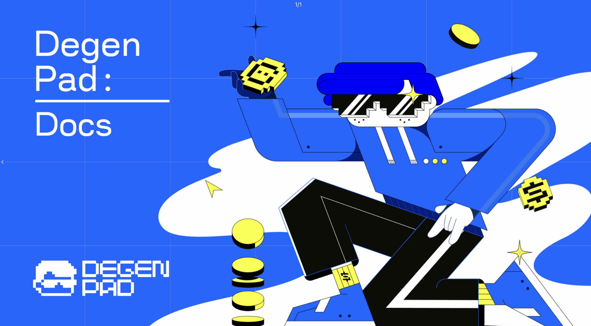

# DegenPad

<figure><figcaption></figcaption></figure>


[introduction-to-degenpad.md](introduction-to-degenpad.md)



[tier-system](tier-system/)



[understanding-low-fdv-projects-on-degenpad.md](understanding-low-fdv-projects-on-degenpad.md)



[ido-rounds-explained.md](ido-rounds-explained.md)



[flexible-refund-policy](flexible-refund-policy/)



[f.a.q.s-degenpad.md](f.a.q.s-degenpad.md)

